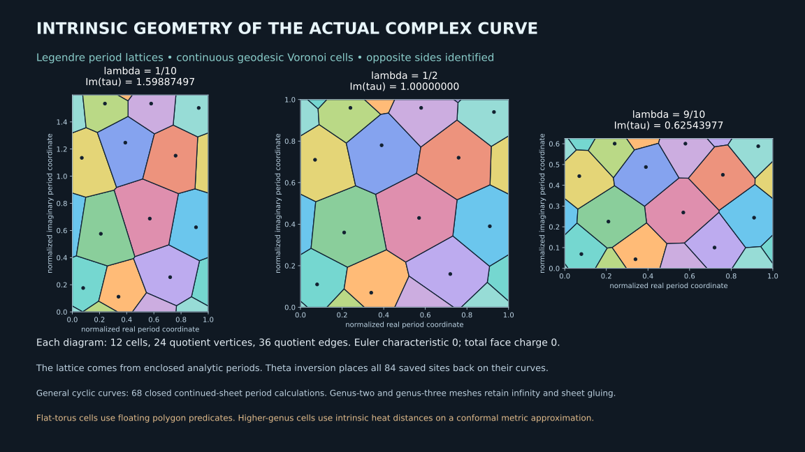

# Intrinsic geometry, conformal metrics and analytic periods on PerfectPower curves

This release turns three previously unfinished interfaces into executable calculations. Legendre curves now have a period-derived conformal torus, continuous intrinsic Voronoi cells, and numerical inverse maps from sites to the original curve. General supported cyclic components have continued-sheet integration of actual closed periods and a smooth differential metric with finite, branch and infinity charts. Connected squarefree hyperelliptic curves also have a closed mesh derived from that complex equation, measured in its conformal metric, with intrinsic heat-distance Voronoi approximations. These are classical constructions implemented in the repository, not claims of new geometric theorems.

The accuracy levels differ. Legendre lattice parameters retain the existing rational series enclosures. Polygon cells and theta inversions use floating arithmetic. General periods use numerical root finding and adaptive quadrature, whose error estimates are not certified bounds. The higher-genus mesh is a piecewise-flat approximation to a smooth conformal metric; its heat Voronoi cells approximate intrinsic geodesic cells. This release does not assert an exact arbitrary-genus Voronoi solver, a general symplectic period matrix algorithm, or new Lean theorems. Those distinctions are carried by the returned data, rather than left implicit.

## A conformal torus belonging to the actual curve

For rational zero less than lambda less than one, take the smooth Legendre curve

\[
y^2=x(x-1)(x-\lambda).
\]

Let omega=dx/y. Its real and complementary imaginary cycles have periods A=2*pi*F(lambda) and B=2*pi*i*F(1-lambda), where F=2K/pi uses the elliptic parameter convention. The existing exact rational series encloses F and the quotient T=F(1-lambda)/F(lambda). The Abel–Jacobi coordinate

\[
u=\frac1A\int\omega
\quad\text{belongs to}\quad
\mathbb C/(\mathbb Z+iT\mathbb Z).
\]

The flat metric |du|^2 pulls back to |dx/y|^2/|A|^2. It is smooth and nondegenerate on the compact curve, including the branch points and infinity, although its density in x has coordinate singularities. This is a conformal metric on the original curve, not a generic torus with the same genus. Its curvature is zero and its area is T. Scaling the metric is a choice; this release normalizes the real period to one.

The polygon computation uses the midpoint of the enclosed T interval. It rejects an enclosure wider than the specified relative threshold, rather than concealing an unresolved lattice parameter. The full interval remains attached to the output. A cell topology change near a degeneracy is not excluded merely by that small width, so the floating topology check is not relabeled as an interval certificate.

## Intrinsic Voronoi cells without a mesh graph

For torus coordinates p and q, the geodesic distance is

\[
d(p,q)=\min_{a,b\in\mathbb Z}
 |p-q+a+ibT|.
\]

Because the lattice is rectangular, each coordinate can be reduced independently to its nearest periodic difference. This is the continuous intrinsic distance on the surface. It is not an edge-path approximation.

To construct the cell of a chosen lift s, begin with the rectangle centered at s having width one and height T. Comparisons against the neighboring translates of s impose exactly those bounds. Compare next against each site's nine translates with shifts in {-1,0,1} squared. For every point in the initial rectangle, more distant translates are dominated by one of these copies; hence the finite list suffices for the infinite periodic Voronoi problem. Each comparison is a Euclidean perpendicular-bisector half-plane. Successive polygon clipping produces the lifted cell. Its copies can be clipped into the displayed fundamental rectangle, with opposite sides identified.

The output retains polygons, areas, side counts and the identity and lattice shift of each edge neighbor. Quotient vertices and edges are identified numerically to inspect Euler characteristic and face incidence. In the saved generic twelve-site examples, the cells are disks, every edge has two incident faces, and every vertex is trivalent. The counts are V=24, E=36 and F=12, giving Euler characteristic zero and total face charge sum(6-q)=0. The cell areas partition the torus area to numerical precision. Inputs with self-neighboring cells, duplicate sites or degeneracies do not receive a blanket disk or trivalent claim. In particular, a one-site torus diagram is not a disk cell decomposition of the closed torus.

The figure shows computed cells for lambda=1/10, 1/2 and 9/10. The changing aspect ratio comes from analytic periods, not from an illustrative deformation of a mesh. The geodesic-distance formula is exact mathematical machinery; its polygon implementation uses floating predicates.

## Putting the sites back on the curve

A site in the period torus corresponds to a genuine point of the complex curve. The implementation makes that correspondence inspectable through Jacobi theta inversion. Set w=2K(lambda)*u and q=exp(-pi*T). Theta quotients evaluate sn(w), cn(w) and dn(w). The inverse coordinates are

\[
x=\lambda\,\operatorname{sn}(w)^2,
\qquad y=\lambda\,\operatorname{sn}(w)
\operatorname{cn}(w)\operatorname{dn}(w).
\]

The Jacobi identities give y^2=x(x-1)(x-lambda), and dx/y=2dw, confirming the normalization of u. The Fourier theta implementation returns its curve-equation residual. The seven saved tori contain eighty-four site inversions; their largest relative residual is approximately 2.72e-14. The point at infinity has its own chart. Floating Fourier sums are not certified interval inversions, and the reported residual does not substitute for such a certificate.

The standard theta definitions are in the NIST Digital Library of Mathematical Functions, [Section 22.2](https://dlmf.nist.gov/22.2), with the Fourier expansions in [Section 20.2](https://dlmf.nist.gov/20.2). DLMF uses the modulus k; this implementation's lambda is k squared.

## Actual periods with continuous sheet transport

The general AnalyticSurface backend starts from the exact normalized component and its holomorphic basis already computed by PerfectPower. The monic equation is z^n=R(x). Distinct roots and their reduced multiplicities are numerically obtained from the exact squarefree blocks. Separation and residual diagnostics are retained. Numerically unresolved roots are rejected; these are not certified algebraic isolators.

Pointwise use of a principal n-th root is insufficient for a period. It would reset sheets along a path and can integrate the wrong function. Instead the integrator continues log R along the entire path and uses z=exp(log R/n). For a circle x=C+r*exp(it), a root a inside the circle contributes

\[
\log(x-a)=\log r+it+
\Log(1+(C-a)e^{-it}/r).
\]

The last logarithm is single valued because its argument stays in a disk centered at one with radius less than one. For a root outside, use

\[
\log(x-a)=\Log(C-a)+
\Log(1+r e^{it}/(C-a)).
\]

Multiplicities weight these contributions. If the enclosed multiplicity is w, the lift closes after n/gcd(n,w) turns. The backend integrates every actual form N(x)dx/z^j along that lifted contour and returns closure labels and quadrature diagnostics. Contractible small root loops give zero periods within numerical accuracy, as the tests check. Circles enclosing different sets of roots can give nonzero periods. Deforming a contour without crossing roots preserves its periods; an independent test checks that behavior.

Circular contours alone can miss useful cycles in higher cyclic covers. The backend therefore also supports signed words in root-loop generators. A generator travels from a common basepoint along a straight stem, circles one root, and returns. Along a root-avoiding straight segment, log(x-a) is continued using the logarithm of the ratio to its starting value. Circle logarithms are anchored to the current branch. A word is accepted as a closed period only when its total multiplicity-weighted monodromy vanishes modulo n. Commutators always satisfy that scalar monodromy condition and can have nonzero periods on the normalized curve.

For z^3=x^3-1, one saved commutator gives a period approximately 9.179724222343157 i for the one-dimensional holomorphic basis. Its inverse gives the negative period, and a generator followed by its inverse gives zero. This is a continued-sheet computation on a curve with complex branch points, beyond the real Legendre series. The word represents a particular cycle and can be nonprimitive. The returned collection is not declared a symplectic homology basis.

The corpus includes five surfaces: the original genus-two curve y^2=x^5-x, a real-root genus-two model, a genus-three hyperelliptic model, the cyclic cubic, and a repeated-root presentation of the genus-two model. There are sixty-eight saved circle or word period computations. Tighter quadrature replays agree to approximately 2.81e-15 in the saved word examples. This measures numerical stability, not rigorous error: root approximation, floating arithmetic and quadrature estimates remain distinct error sources. General certified integration and symplectic reduction would extend this backend toward the methods of Molin and Neurohr, [Computing period matrices and the Abel-Jacobi map of superelliptic curves](https://arxiv.org/abs/1707.07249).

## Smooth metrics on higher-genus components

Let omega_i=h_i(x)dx be the explicit holomorphic basis on one compact normalized component. For positive genus, define

\[
ds^2=\sum_i|\omega_i|^2,
\qquad \rho(x)=\sum_i|h_i(x)|^2.
\]

The canonical differential system has no common zero, so this is a smooth positive conformal metric on the compact surface. Its scale and weighting depend on the chosen basis. This release uses its explicit monic component basis; it does not call the result a period-normalized Bergman metric.

Away from roots, differentiating the exact coefficient operators gives h_i'. The local Gaussian curvature is evaluated by

\[
K=-\frac{2}{\rho^3}
\left(\rho\sum_i|h_i'|^2
-\left|\sum_i\overline{h_i}h_i'\right|^2\right).
\]

Cauchy–Schwarz makes it nonpositive. For genus one, the one-dimensional expression vanishes and the metric is flat. For genus two with basis dx/y and x dx/y, rho=(1+|x|^2)/|R(x)| and the formula simplifies to K=-2/[rho(1+|x|^2)^2]. The tests compare the general implementation to this independent expression.

At a root of reduced multiplicity e, the chart x=a+t^(n/gcd(n,e)) removes the apparent x-coordinate singularity. The known valuation orders select the nonzero leading coefficients at t=0; the metric density is positive there. At infinity use x=t^(-n/delta). The monic numerator leading terms and the recorded infinity orders provide the limiting density. These evaluations also work on repeated-root normalized components. Genus zero has no holomorphic one-forms, so this differential metric is rejected there rather than returning zero as a Riemannian metric. A rational or spherical metric for arbitrary genus-zero models remains a separate choice.

## A closed mesh from the equation, not just its genus

The hyperelliptic mesh backend currently accepts connected squarefree curves of positive genus. It triangulates a complex-plane chart containing every branch point, caps it with the infinity chart, and subdivides triangles so each contains at most one branch vertex. Each regular vertex has two lifts; a simple branch vertex has one. Infinity has one lift for odd degree and two for even degree. Edge transports come from analytic continuation of the square root, with the inverse-coordinate chart used on the cap.

These transports glue the triangles into the actual branched cover. The implementation checks every regular face cocycle, every two-face edge incidence, every cyclic vertex link, connectedness and orientability, and the Euler count 2-2g. This is materially different from selecting an arbitrary polygon model of the same genus. The retained base coordinates, lifted vertex labels, triangle incidences and orientation signs make the construction inspectable.

Edge lengths are numerical integrals of the smooth differential metric along chart paths. Sin-squared endpoint substitutions handle simple branch and infinity singularities. The resulting lengths define a piecewise-flat metric approximation. Every triangle must satisfy the triangle inequalities; if a coarse resolution fails, it is rejected and the builder tries a finer one. Lengths are not silently clipped to manufacture valid triangles. The mesh retains angles, areas, defects and the total curvature. The genus-two defects sum to -4*pi and the genus-three defects to -8*pi, with numerical residuals near machine precision. Those discrete Gauss–Bonnet totals do not establish local convergence to the smooth curvature.

The original genus-two refinement receipts show mesh areas approximately 37.2846, 36.7278 and 36.3723 at the three saved resolutions. Their variation is visible: this is not a certified converged smooth area. More refinement and quantitative approximation estimates are needed for that claim.

## Higher-genus intrinsic Voronoi approximations

The mesh Voronoi backend uses the intrinsic triangle geometry. It assembles finite-element mass and stiffness matrices, solves a heat equation for each site, normalizes the facewise negative heat gradients, and solves a Poisson equation for an approximate geodesic distance field. Farthest-point sampling selects separated sites using these fields. This is the heat method, not shortest paths along mesh edges.

Within every triangle, all site distance fields are linearly interpolated. Half-plane clipping in barycentric coordinates constructs the regions where one site's interpolated distance is minimal. All competing sites are retained, rather than only those winning at the corners. The output contains the actual polygon pieces and their intrinsic areas. The three saved meshes use eight sites each. Their pieces partition the mesh area to numerical precision.

The distances approximate continuous geodesics on the piecewise-flat approximation, and that surface approximates the smooth curve metric. These are two numerical approximation layers, neither of which should be confused with the torus's direct continuous-distance construction. The output explicitly records this scope and any negative raw-distance residual before clipping. It does not claim a certified trivalent cell complex or exact higher-genus geodesic boundaries. A reference implementation of surface geodesic Voronoi machinery is described in [Geometry Central](https://geometry-central.net/surface/algorithms/geodesic_voronoi_tessellations/); the heat-distance method originates in Crane, Weischedel and Wardetzky, [Geodesics in Heat](https://www.cs.cmu.edu/~kmcrane/Projects/HeatMethod/).

## Running and extending the computation

`PYTHONPATH=python python -m perfectpower intrinsic-voronoi --lambda 1/2` returns the conformal torus, its cells and the curve coordinates of its sites. `analytic-periods --coeff=-1,0,0,1 --d=3 --word '[1,2,-1,-2]'` computes the cyclic-cubic commutator period. `conformal-metric --coeff=0,-1,0,0,0,1 --d=2 --point '[0.3,0.7]'` returns the finite metric and curvature together with branch and infinity chart limits. `conformal-voronoi --coeff=0,-1,0,0,0,1 --resolution 6 --sites 8` constructs the original genus-two cover mesh and its intrinsic Voronoi approximation.

General periods and meshes require the optional dependencies in python/requirements-analytic.txt. The rational Legendre enclosures and flat-torus polygon calculations remain standard-library computations. `python/build_analytic_geometry.py` rebuilds all saved examples, and `python/render_analytic_geometry.py` renders the actual torus diagrams. The earlier arithmetic data and proofs are not changed by these geometric calculations. Geometry does not by itself settle isolated integer hits or supply new integer-height bounds.

The completed focused suite passed thirteen tests. The full Python suite passed 525 tests with four existing skips, using NumPy 2.3.5 and SciPy 1.17.0. Independent checks cover the real-cut integral, contour deformation, inverse words, sheet closure, smooth metric charts, vertex links and orientability, periodic continuous-distance comparisons, original-curve site residuals and area partitioning. No new Lean source is included in this numerical release. The latest parent release already records all 3,080 quartic lists as kernel checked; these computations preserve that ledger.
