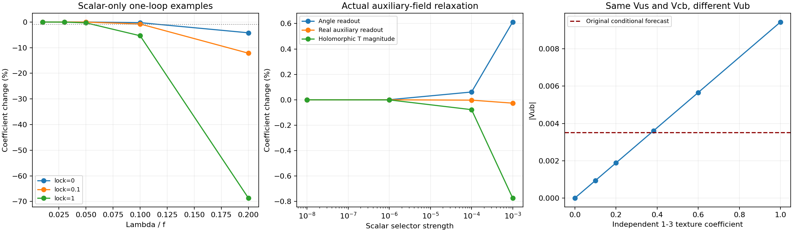

# Protected equations, selected vacua and a quark-operator obstruction

## What this push accomplishes

The candidate now has an explicit renormalizable supersymmetric singlet sector, a holomorphic golden-coefficient extension, an actual auxiliary-field relaxation calculation, and a one-loop calculation including every scalar and fermion in that sector. The 34-field extension has 68 real scalar modes and 34 Weyl fermions. In the declared numerical examples, a small scalar energy selector prefers the branches near plus and minus 66 degrees, and the one-loop corrections leave that preference intact among all sixteen continued branches. The construction produces a quantitatively controlled realization of the nominated vacuum. It does not derive the initial superpotential coefficients or the energy-selector pattern from an independently specified symmetry, and it does not derive the nominated exact CKM relation from quark interactions.

The strongest negative result is exact: the scalar-only version of the potential is not closed under its own one-loop divergent counterterm. Polynomial division yields a nonzero torque remainder, and a Bezout identity shows that the remainder vanishes at none of the primitive real order-60 roots. Thus there is a specific radiative protection problem, even before quarks or gauge fields are introduced. The strongest constructive result is an initialized holomorphic constraint circuit whose supersymmetric zeros are perturbatively protected. Soft selection then produces small calculable departures instead of an exact unchanged angle.

The quark calculation exposes another independent issue. The declared flavor charges allow the required hierarchy of operators, but their coefficients are independent. Exact diagonalization of a selected triangular texture, even with its 1-3 coefficient initialized to the golden value, gives a different observable mixing strength. This is a constructive counterexample to assuming that the right spurion powers automatically imply the exact CKM formula.

## The original exact carrier and energy winner

Define x=2 cos(theta), P(x)=x^8-7x^6+14x^4-8x^2+1 and Q(x)=-1+3x-x^3. The previously constructed potential obeys V'(x)=P(x)Q(x). Its six nonconstant angular terms are cos(2 theta)+(2/3)cos(3 theta)+(2/5)cos(5 theta)+(1/4)cos(8 theta)-(2/9)cos(9 theta)-(1/6)cos(12 theta). V differs from that angular expression by the constant 11/12. Exact rational Sturm isolation and energy enclosures selected x=2 cos(66 degrees) on [-2,2], with more than 0.060 separation from the next competing stationary energy in the polynomial normalization.

The new family V_lock(x)=lambda P(x)^2+eta V(x), lambda>=0 and eta>0, obeys V_lock'(x)=P(x)[2 lambda P'(x)+eta Q(x)]. Its global winner is unchanged: the added square is nonnegative, vanishes at the old winner, and the original potential already has a unique global winner in x. This statement covers the full declared parameter orthant without discretizing lambda or eta. The two full-circle CP partners remain degenerate. This is a mathematical family, not an assertion that the interaction generating lambda or eta has been identified.

The rational stationary-family constraint is stronger than stationarity under arbitrary real couplings at just one chosen angle. Rational coefficients force Galois-conjugate roots to share the polynomial factor. An isolated real linear torque condition at a prescribed angle is not equivalent to the eight rational relations found for the twelve-harmonic carrier. The field model must explain which of those structures it actually enforces.

## A precise scalar-loop obstruction

Give the angle the kinetic term f^2 (partial theta)^2/2 and the physical potential Lambda^4 V(2 cos(theta)). With D(x)=4-x^2, its dimensionless angular curvature is h(x)=D(x)V''(x)-x V'(x). The physical field-dependent squared mass is Lambda^4 h(x)/f^2. The one-loop scalar divergence contains a coefficient proportional to this mass to the fourth power. Consequently the question of preserving the stationary family reduces to whether P divides the x derivative of h^2.

For the original potential, the exact remainder is R(x)=5040-6880x-31360x^2+43600x^3+24160x^4-30080x^5-4400x^6+4800x^7. Its gcd with P is one. The stored rational Bezout multipliers satisfy a(x)P(x)+b(x)R(x)=1. Since sin(theta) is nonzero at every primitive order-60 angle, a nonzero x torque also means a nonzero angular torque. This establishes that the original family is not closed under this particular divergent scalar counterterm. It does not establish that every model containing additional fields must fail.

The coefficient field can also be included. Write c(x)=1-S_12(x), where S_n(2 cos(theta))=2 cos(n theta), and take F(theta,C)=V_lock(2 cos(theta))+kappa[C-c(x)]^2. On its tree valley, with kinetic scales f and g, the polynomial proportional to Tr(M^4)/Lambda^8 is [h+2 kappa D(c')^2]^2/f^4+8 kappa^2 D(c')^2/(f^2 g^2)+4 kappa^2/g^4. The derivative is again reduced modulo P. All sixteen declared angular-only and two-scalar parameter cases give nonzero remainders. The calculation includes the coefficient scalar instead of silently integrating it out before evaluating the loops.

## Finite scalar-loop displacements

The scalar-only numerical calculation uses the local positive-mass MSbar expression Delta V=m^4[log(m^2/mu^2)-3/2]/(64 pi^2). The renormalized additional finite Wilson coefficients are initialized to zero at the stated mu. Every example declares Lambda/f, the lock coefficient and mu/m_tree. Resetting that boundary condition at another mu defines another example; it is not a claim that a fixed physical theory depends on the arbitrary renormalization scale after consistent running.

At theta0=66 degrees, U''=12.2092424208 and U'''=-140.847974475. The first-order angular displacement is -Delta U'(theta0)/U''(theta0). For Lambda/f=0.1, no added lock, and mu=m_tree, the numerical stationary point is approximately 65.997446321 degrees. The angle-based coefficient changes by about -0.2663 percent. The small-ratio displacement scales as (Lambda/f)^4. The derivative and curvature are independently checked against finite differences, and the nonlinear stationary solution is compared with its linear prediction.

The sweep retains sixty angular examples. One leaves the physical positive-depth CKM chart; it remains in the results with a null CKM forecast rather than being dropped. Eighty of eighty-one declared two-scalar examples produce a controlled local stationary solution with a positive numerical Hessian. The unsuccessful case is retained with its parameters and failure reason. These calculations certify neither a global quantum minimum nor a cosmological occupation probability.

At the tree portal C=1-2 cos(12 theta), dC/dtheta=22.8253563911 at the selected angle. A one-percent coefficient tolerance corresponds locally to about 0.00958804 degrees. Adding a large classical locking term is not automatically a radiative solution: it changes the mass and its derivatives, which also changes its own loop torque. The stored sweeps illustrate this effect directly.

## A cubic supersymmetric constraint circuit

Introduce sixteen gauge-singlet chiral fields Z_1,...,Z_16, with Z_1=Z, and sixteen drivers D_2,...,D_16,D_star. All Z fields have R charge zero; all drivers have R charge two. The declared CP action is complex conjugation and the chosen coefficients are real. A common real coupling can multiply the superpotential. With a real positive reference mass M, the base superpotential is W=sum_(n=2)^16 D_n(M Z_n-Z Z_(n-1))+M D_star[Z_16+Z_14-Z_10-Z_8-Z_6+Z_2+M]. Every term has mass dimension three.

At D=0, F-flatness gives z_n=z^n, where z_n=Z_n/M, and Phi_60(z)=z^16+z^14-z^10-z^8-z^6+z^2+1=0. There are sixteen simple complex roots. They have unit modulus and are the primitive order-60 roots. This is an explicit renormalizable circuit implementing the algebraic equation; it avoids introducing a degree-sixteen superpotential interaction in the fundamental variables.

The constraint Jacobian J has nonzero determinant at every root. Its determinant divided by Phi_60'(z) is minus one in the declared ordering. Thus the chosen vacua are isolated. The full holomorphic mass matrix has blocks [[0,J^T],[J,0]], and every singular value of J occurs twice. With canonical kinetic terms, each pair has four real scalar modes and four fermionic spin modes with equal masses. The unbroken-SUSY one-loop contribution cancels at the F-flat zeros.

Perturbative protection here is the Wilsonian superpotential non-renormalization result for an initialized, globally supersymmetric sector, with a nonsingular positive Kahler metric. It does not force the initial coefficient choices. Kinetic corrections do not remove a zero of all F terms, but they change spectra and matter when supersymmetry is broken. This distinction follows the Wilsonian treatment of non-renormalization, rather than treating a generic 1PI potential as an unchanged superpotential [2].

## What the declared symmetry actually permits

For the base singlet sector, the complete holomorphic superpotential basis through field degree three has 2,448 monomials. R charge forces one driver, followed by zero, one or two neutral fields: 16(1+16+136). The selected circuit uses 37 monomials. CP and the declared R symmetry allow many other coefficients. They protect neither the chosen sparse pattern nor its relative integer values by themselves. The general CP-even quadratic Kahler metric contains 272 real parameters in the two neutral/driver blocks; the numerical mass calculations initialize it canonically.

A real change of the D_star tadpole changes Phi_60(z) to Phi_60(z)+epsilon. This deformation is allowed by the declared symmetries and changes both phase and radius. It demonstrates freedom in the initialized theory. It is not a claim that perturbative supersymmetric loops generate that absent term in the Wilsonian superpotential.

For a separate one-complex-field comparison, all CP-even operators Re(z^a conjugate(z)^b), a>=b, 1<=a+b<=12, are enumerated. There are 48 operators when no rotation symmetry is imposed; 42 have a nonzero carrier torque. The six desired harmonic numbers have gcd one. Among all cyclic rotations tested, orders two through sixty cannot permit every desired harmonic. This is a precise obstruction for that one-field CP-plus-cyclic class, not for arbitrary multi-field finite groups.

## A holomorphic golden-coefficient extension

The inverse phase needed for the original coefficient can be represented in the carrier without complex conjugation. Since z^60=1 on Phi_60=0, z^-12=z^48. Exact reduction gives T=1-z^12-z^48=2-z^4-z^6+z^14 modulo Phi_60. It obeys T^2-3T+1=0. At the root with phase 66 degrees, T=(3-sqrt(5))/2, with zero imaginary part.

Two additional chiral fields T and D_gold implement this linearly: W_gold=M D_gold[T-2M+Z_4+Z_6-Z_14]. T has R charge zero and D_gold has charge two. The extended model has 34 chiral fields and remains renormalizable. Its general allowed singlet superpotential through degree three contains 2,907 monomials. The extension fixes a golden spurion value in the selected initialized vacuum, while preserving the sixteenfold supersymmetric degeneracy. It does not fix a quark Wilson coefficient or explain why the twelfth power is the desired coefficient operator.

## Actual field relaxation under energy selection

To lift the degeneracy, the worked scalar deformation is V_soft/M^4=g_W^2 epsilon sum a_n Re(z_n), with the six nonconstant Fourier coefficients a_n. This is an explicitly chosen supersymmetry-breaking scalar tadpole pattern. At exact circuit roots its leading energy is the original angular potential times g_W^2 epsilon. The full fields are then allowed to relax; they are not constrained to remain equal to powers of a unit-modulus number.

For fixed z_1, the other fifteen base neutral fields enter the F-term potential quadratically. They are eliminated by linear least squares, including the scalar tadpoles. The remaining complex z_1 is optimized in both its real and imaginary coordinates. All sixteen branches are continued for epsilon=10^-8,10^-6,10^-4,10^-3. The branches descended from root powers eleven and forty-nine have the lowest energies in every declared continuation. Every retained branch has a positive reduced tree Hessian. This is a comparison of local continued vacua, not a proof that the full polynomial field potential has no distant competing vacuum or runaway.

At epsilon=10^-4, the positive branch has phase 66.0005874177 degrees and radius 1.00002214970. The angle-only readout gives C=0.382200029974. The nonholomorphic real auxiliary readout 1-2 Re(z_12) gives 0.381955432748. The holomorphic extension gives T=0.381669772701-0.000178406720 i. These are different operators once the fields relax. A quark interaction must specify which operator it actually uses. Choosing a real auxiliary readout in a holomorphic superpotential would require a different construction; it cannot be substituted silently.

## Full-circuit leading quantum calculation

The full quantum calculation includes the 34 chiral fields of the golden extension. On the R-symmetric D=0 slice, let F be the vector of driver constraints, J their Jacobian with respect to the seventeen neutral fields, and H_k their constant quadratic Hessians. Define A=J^dagger J and B=sum conjugate(F_k) H_k. In canonical sqrt(2) real and imaginary neutral coordinates, the scalar squared-mass matrix is [[Re(A+B),-Im(A)-Im(B)],[Im(A)-Im(B),Re(A-B)]]. The driver scalar block has the corresponding unsplit singular-value spectrum.

The driver scalar trace cancels half of the fermion trace. The complete singlet one-loop potential therefore equals g_W^4/(64 pi^2) times [sum_(34 neutral real modes) b_i^2(log(g_W^2 b_i/mu^2)-3/2)-2 sum_(17 Jacobian modes) a_i^2(log(g_W^2 a_i/mu^2)-3/2)]. This expression accounts for all 68 real scalars and 34 Weyl fields, not just the light angular mode. It is evaluated in a DRbar example with canonical renormalized Kahler metric and specified scalar tadpoles at the reference scale. There are no gauge fields in this singlet-sector calculation.

The gradient uses eigenvector contractions with the analytic derivatives of A and B. It is independently checked against potential differences. At exact F-flat roots, the potential and gradient cancel to numerical roundoff. At the softly selected vacuum, the gradients need not cancel. The quantum stationary equations are solved in all thirty-four real neutral coordinates; the corrected neutral-sector Hessian is numerically positive. An independent expression for the complete 68-scalar, 34-Weyl effective potential also computes the quantum driver-block Hessian by finite differences. The unbroken common driver R phase makes the neutral-driver block vanish at zero drivers. Both corrected blocks have positive minimum eigenvalues in all nine declared cases. Step-size comparison checks the driver Hessian, while the agreement of the independent full and reduced potentials checks the mode counting. These are numerical local stability checks at one loop, rather than exact certificates or a higher-loop theorem.

Nine epsilon/coupling examples are retained: epsilon=10^-6,10^-4,10^-3 and g_W=0.1,0.3,1. All produce controlled numerical neutral-sector minima. Leading tree-plus-one-loop energy comparisons among all sixteen continued branches retain root powers eleven and forty-nine. At epsilon=10^-4 and g_W=0.3, the phase becomes 66.0005860473 degrees, a quantum displacement of approximately -1.37037 times 10^-6 degrees relative to the relaxed tree minimum. The coefficient field becomes T=0.381670086337-0.000178010587 i. The largest actual neutral-coordinate quantum displacement is about 4.67 times 10^-7. These are chosen weak-coupling examples, not experimental uncertainties or a derived cosmological scale.

## Quark operators: hierarchy without an enforced coefficient

The declared holomorphic quark sector uses two flavor charges. The left-handed doublets Q_i have charges (1,1),(0,1),(0,0), while u_i^c and d_i^c have the opposite charges. H_u,H_d and all neutral circuit fields have zero flavor charge. A has charge (-1,0), B has charge (0,-1), and Q,f^c have R charge one. The scalar A and B backgrounds remain free inputs. No anomaly-free gauged flavor completion or mechanism fixing their magnitudes is claimed.

All allowed operators Q_i H f_j^c A^a B^b times neutral monomials are enumerated through superpotential field degree six. There are 6,460 operators with the sixteen base neutral fields, and 7,560 when T is included. The up and down sectors have independent real coefficients before spontaneous CP breaking. The pure singlet enumeration and this Yukawa enumeration are complete within their declared sectors and degree bounds; they are not an enumeration of all Standard Model, lepton or higher-Kahler interactions.

In particular, Q_1 H d_2^c A, Q_2 H d_3^c B, and Q_1 H d_3^c A B carry independent coefficients. Allowing their spurion powers does not relate those coefficients. A T insertion can multiply the third operator, but its independent coefficient and the lower-degree A B operator remain allowed. Neutral fields can also appear in diagonal and up-sector entries. The phase of the scalar vacuum therefore does not automatically become the standard CKM phase. Higher-Kahler interactions such as Q_1^dagger Q_2 A^dagger/M are allowed and can alter canonical normalization.

## A derived texture counterexample

The worked trial uses Y_u=diag(u_1,u_2,u_3) and an upper-triangular Y_d with entries Y_12=a d_2, Y_23=b d_3 and Y_13=c a b exp(-i theta)d_3. The diagonal spectra are declared positive numerical inputs. This is a selected member of the allowed operator family. Up-sector off-diagonal terms and most neutral insertions are initialized to zero; the symmetry does not forbid them.

The matrices are diagonalized through the eigenvectors of Y Y^dagger. For each independent c, only a and b are matched to the two existing anchors |V_us|=0.22431 and |V_cb|=0.0411. The values of |V_ub| and CP observables are then consequences of the matrix, without fitting them. At c=phi^-2 and theta=66 degrees, the texture gives |V_ub|=0.00360299463 and effective depth 0.390811666690, rather than the nominated chart's 0.00352144218 and 0.381966011250. Its standard CKM phase is approximately 65.9786293 degrees. Finite diagonalization effects matter even in this simple hierarchical matrix.

Changing the independent coefficient while retaining the same two anchors changes |V_ub| substantially. The stored six-coefficient sweep supplies explicit examples. This is a mathematical obstruction to inferring the exact relation s_13=C s_12 s_23 from charge arithmetic alone. A stronger quark construction must relate Wilson coefficients, kinetic normalization and matrix diagonalization, or predict the correction instead of absorbing it into a fit.

## Scale evolution as a separate matching test

The implementation also integrates one-loop Standard Model matrix Yukawa equations using t=log(mu), left-row Yukawa convention and SU(5)-normalized g_1. In this convention beta_u=[(3/2)(H_u-H_d)+T_gauge,u I]Y_u/(16 pi^2), with the corresponding down and lepton equations and the one-loop gauge equations. The source's log(mu^2) convention is converted explicitly [3]. Rephasing invariance, a common-left-basis covariance check and the top-only limit independently check the implementation.

The example initializes the original exact CKM chart with declared illustrative spectra and gauge couplings. At mu/mu0=10^8, its effective depth differs from phi^-2 by about -8.62 times 10^-5 relatively, and its standard phase differs by about -0.00349036 degrees. The absolute |V_ub| also changes as the anchors run. No measured matching scale is supplied. This is a standalone SM evolution diagnostic, not a threshold-matched evolution of the supersymmetric circuit. It shows that a claim of an exact flavor relation must identify the scale at which it is imposed.

## What is now supported and what remains physical

The exact supports are the carrier algebra, the stationary-family identities, the global-winner preservation argument, the scalar-counterterm remainder and Bezout witness, and the complete declared finite operator spaces. The supersymmetric protection is a conditional application of the established Wilsonian non-renormalization result to the supplied globally supersymmetric circuit. The mass spectra, relaxed fields, one-loop extrema, quark diagonalizations and SM evolution are numerical computations with explicit parameters and limitations. No new Lean theorem is claimed.

The constructed model answers whether an initialized protected equation can be implemented by renormalizable fields and whether a specified weak selector produces a controlled nearby vacuum. It does so. The outstanding physics is the origin of the sparse initialized coefficients and selector terms, a quark interaction enforcing or replacing the nominated exact mixing rule, consistent kinetic and threshold matching, higher-loop stability, and a vacuum history. The branch comparison does not choose the positive CP sign. A complete theory of strong CP or baryogenesis has not been supplied.

## Reproduction and retained calculations

Run PYTHONPATH=python OPENBLAS_NUM_THREADS=1 python python/develop_flavor_completion.py from the repository root, then the corresponding plot_flavor_completion.py. Run unittest discovery with test_flavor_completion.py for the new mathematical and numerical checks, or test_flavor*.py for the combined flavor checks. NumPy and SciPy support numerical spectra, extrema and running; Matplotlib supports the scientific figure. Exact polynomial identities and operator labels use rational arithmetic and the existing PerfectPower algebra.

The receipts retain all declared cases, including one uncontrolled two-scalar continuation and one angular example outside the positive-depth CKM chart. The two exhaustive quark-operator tables are stored as deterministic gzip-compressed JSON; ordinary gzip decompression recovers the complete tables. The manifest covers the scientific JSON outputs, including those compressed tables. Fresh-copy reproduction checks those outputs in the same numerical runtime. A byte-identical replay is evidence of reproducibility in that environment; the tests provide separate mathematical and numerical checks. PDF generation uses ReportLab and standard installed fonts. Source code, prior repository work, raw receipts, diagrams and the monograph are included in the complete handoff archive.

The final repository-wide Python run completed 841 tests successfully, with four skips. The 25 new completion tests cover the exact carrier obstruction, circuit elimination and mode pairing, independent loop gradients, corrected driver Hessian, complete declared operator enumeration, texture counterexamples and scale-evolution covariance. A fresh archive extraction reproduced all twenty scientific receipt, manifest and figure files byte for byte in the declared runtime. No new Lean theorem was added in this push.

## Primary references

[1] S. Coleman and E. Weinberg, Radiative Corrections as the Origin of Spontaneous Symmetry Breaking, Physical Review D 7, 1888 (1973). https://doi.org/10.1103/PhysRevD.7.1888. This supplies the effective-potential framework; the worked scalar and circuit schemes are stated explicitly above.

[2] N. Seiberg, Naturalness Versus Supersymmetric Non-renormalization Theorems (1993), https://arxiv.org/abs/hep-ph/9309335. The relevant distinction is protection of a chosen Wilsonian superpotential, with separate kinetic and supersymmetry-breaking effects. It does not derive the chosen flavor coefficients.

[3] A. V. Bednyakov, A. F. Pikelner and V. N. Velizhanin, Three-loop SM beta-functions for matrix Yukawa couplings (2014), https://arxiv.org/abs/1406.7171. The one-loop matrix conventions and scale conversion are the parts used here.

[4] I. de Medeiros Varzielas, D. Emmanuel-Costa and P. Leser, Geometrical CP violation from non-renormalisable scalar potentials (2012), https://arxiv.org/abs/1204.3633. This is a comparison for symmetry-constrained higher-order operators preserving particular vacua; it does not establish the present order-60 construction.
