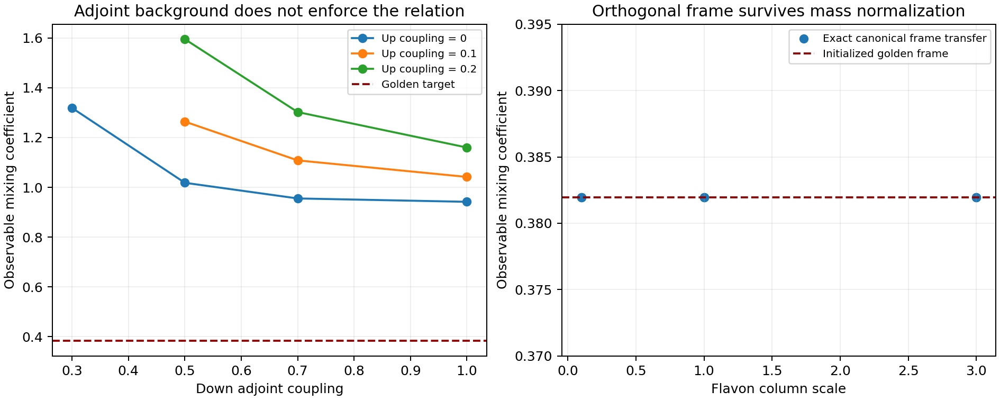

# Shared mediators and the alignment boundary

## What this mediator push establishes

The next step now has an explicit non-Abelian quark mediator construction and an exact tree matching calculation that includes the light right-handed kinetic normalization. The family symmetry makes each heavy mediator mass proportional to the identity and gives one contraction for each flavon column. Separately orthogonal flavon frames then determine the CKM matrix independently of the six column magnitudes and the two flavor-universal mediator masses. This is a constructive quark interaction that transmits an initialized mixing frame without the finite-mass diagonalization errors of the previous triangular texture.

It does not independently derive that frame. The accompanying scalar analysis gives a precise obstruction to the simplest alignment route. For six fundamental flavons with separate phase symmetries, fixed positive norms and exactly orthogonal up and down frames, every CP-even orientation term through scalar degree six reduces to a constant plus a linear function of |V_ij|^2. An exact rational assignment certificate proves that a permutation always attains its global minimum on the frame manifold. A generic nondegenerate cost therefore cannot select the required hierarchical CP-violating mixing. Degenerate costs can leave mixed flat directions; those are not a unique prediction.

I also tested a more favorable alternative in which an adjoint mediator mass contains initialized neighboring mixings, a golden 1-3 entry and the 66-degree phase. Both up and down adjoint couplings are allowed independently by the symmetry. Exact tree matching and canonical normalization were performed before extracting CKM quantities. Thirty of thirty-six declared cases satisfy the numerical control criteria. Every accepted case fails the golden target by more than one percent, despite matching the two existing anchors. The six unsuccessful or uncontrolled cases are retained with their reasons. The construction is therefore a tested candidate and a boundary result, not a completed predictive theory of flavor.

## The exact observable target

Write u=|V_us|, v=|V_cb| and w=|V_ub|. The nominated physical relation is C_eff=w(1-w^2)/(uv)=phi^-2, where phi=(1+sqrt(5))/2. This follows from the original standard-angle rule s_13=C s_12 s_23 because u=s_12 c_13, v=s_23 c_13 and w=s_13. It is already rephasing invariant. Relating a Yukawa matrix entry to other entries is insufficient unless its diagonalization yields this observable equation.

For p=u^2, q=v^2 and r=w^2, define A=r(1-r)^2. Eliminating C from C^2-3C+1=0 gives A^2-7pqA+(pq)^2=0. The positive physical branch C_eff<1 selects phi^-2; the other positive root is phi^2. The equation does not fix a CP phase. In raw fixed-norm flavon overlaps its formal maximum scalar degree is twenty-four. Squaring it into an energy term would encode the desired result by construction and would not explain its origin.

The existing anchors remain u=0.22431 and v=0.0411. The small-branch target is w=0.00352144218276. No new experimental data or fit to |V_ub| or CP measurements was introduced. All numerical examples use declared illustrative quark spectra and dimensionless mediator units. A claim of an exact relation still needs a specified matching scale and subsequent threshold and running calculations.

## An exact Abelian obstruction for the initialized circuit

Consider an additional ordinary diagonal Abelian phase action preserving every monomial of the initialized singlet superpotential, with its mass M and numerical coefficients neutral. The recursion terms force q(Z_n)=n q(Z_1) and q(D_n)=-n q(Z_1). The constant Dstar term forces q(Dstar)=0. Its remaining terms require n q(Z_1)=0 for n=2,6,8,10,14,16. Their greatest common divisor is two, so the general character relation is 2 q(Z_1)=0.

The golden extension has a constant Dgold term, forcing q(Dgold)=0. Its linear Dgold T term then forces q(T)=0. Hence an operator O and O T have the same additional charge. Such a charge rule cannot forbid Q_1 H d_3^c A B while allowing Q_1 H d_3^c A B T. The implementation derives the monomial constraints from the existing circuit rather than a separate assumed polynomial, and checks cyclic groups of orders one through 120. The focused test independently extends those checks through order 240.

This result is deliberately restricted. Charged mass or coupling spurions, symmetries mixing fields, and non-Abelian representations can change the premises. Treating the initialized coefficients as transforming spurions would supply a different model and would require its own alignment and coupling audit. The obstruction does not rule out flavor symmetry in general.

## The declared non-Abelian mediator sector

Use the Standard Model gauge group, a formal global SU(3)_F family symmetry, six independent U(1) flavon phase symmetries and CP. Q is a family anti-triplet. The three right-handed-conjugate up fields and the three right-handed-conjugate down fields are family singlets. There are six complex gauge-singlet fundamental flavons F_ui and F_di. Each carries its own phase charge +1, while its associated right-handed-conjugate quark carries -1. The Higgs and Q have zero phase charge.

Introduce heavy X_u and X_d family anti-triplets and X_u^c and X_d^c family triplets. X_u and X_u^c are vectorlike color-triplet weak-singlet fermions with hypercharges +2/3 and -2/3. X_d and X_d^c have hypercharges -1/3 and +1/3. Each family triplet gives three heavy Dirac species, for six species overall. These pairs are vectorlike under the Standard Model. The global family group is not claimed to be an anomaly-free gauged completion; its Goldstone and cosmological questions are outside this calculation.

In ordinary left-handed Weyl notation, the allowed core interactions are M_f X_f dot X_f^c, h_f Q dot H_f X_f^c and sum_i lambda_fi X_f dot F_fi f_i^c, plus their Hermitian conjugates. H_u is the Higgs doublet and H_d is its conjugate doublet. This notation is an ordinary non-SUSY mediator model. It is not a combined softly broken completion of the previously constructed 34-chiral-field singlet sector.

The operator audit exhausts fermion mass bilinears and two-fermion-one-scalar Yukawa invariants in this declared quark sector. It checks Standard Model gauge representations, family representations and all six phase charges. With the seventeen neutral scalar backgrounds Z_1 through Z_16 and T, including their conjugates, there are 78 independent invariant coefficients. Two are bare universal masses, two are Higgs vertices, six are flavon-column vertices and 68 are neutral-scalar universal-mass vertices. CP permits real coefficients; it does not equate them. Lepton interactions and a complete scalar potential for all neutral backgrounds are outside this finite audit.

Adding one complex phase-neutral family adjoint Sigma and its conjugate adds four invariants, giving 82. They are X_u Sigma X_u^c, X_u Sigma^dagger X_u^c, X_d Sigma X_d^c and X_d Sigma^dagger X_d^c. Up and down coefficients are independent. In the Hermitian background used below the two coefficients in each sector combine into one real number, but the symmetry does not impose any relation between the sectors or between an adjoint coupling and a singlet mass.

## Canonical tree matching without a small-flavon expansion

Let L_f be the 3 by 3 matrix of flavon columns multiplied by their lambda_fi couplings, and let M_f be the invertible heavy mediator mass matrix. At zero Higgs background the heavy fermion row block is [L_f,M_f]. Define A_f=M_f^-1 L_f, K_f=I+A_f^dagger A_f and R_f=K_f^-1/2. A normalized basis for the three light right-handed fields is N_f=[R_f;-A_f R_f]. Direct multiplication gives [L_f,M_f]N_f=0 and N_f^dagger N_f=I.

The Higgs vertex projected into that normalized null space gives Y_f=-h_f A_f R_f. This is exact at tree order at unbroken electroweak matching, to all orders in the ratio of flavon mixing to heavy mass. It is not the unnormalized expression -h_f M_f^-1 L_f. No loop threshold is included. At finite Higgs vacuum value, higher-dimensional Higgs operators and mixing with weak-singlet heavy fermions also affect the charged current. The dimension-four effective CKM matrix is unitary; the finite-Higgs full theory need not give an exactly unitary light 3 by 3 submatrix.

The focused checks verify the normalized null frame and Yukawa projection directly. They also compare against independent singular values of the complete 6 by 6 fermion mass matrix [[0,h_f v_H I],[L_f,M_f]]. The three light singular values divided by v_H converge to those of the matched Y_f. A separate finite-Higgs test compares the light charged-current overlaps with the matched CKM limit and checks their small departure from unitarity. Noncommuting mass matrices are tested under a common family-basis rotation, so the checks do not rely only on diagonal mediator masses.

## What universal masses can and cannot transmit

For a universal mass M_f=m_f I and a general singular decomposition L_f=U_f diag(s_fi) W_f^dagger, the canonical Yukawa matrix has the same left eigenvectors U_f. Its singular values are |h_f| s_fi/sqrt(|m_f|^2+s_fi^2). This map is strictly increasing for positive s_fi, preserving nondegenerate mass ordering. Thus changing a flavor-universal mediator mass, even by a complex golden or cyclotomic background, cannot change the mixing angles or physical CKM phase of fixed L_u and L_d. This statement does not require orthogonal flavon columns.

With separately orthogonal columns, L_f=U_f diag(ell_fi), the stronger separation holds: changing each individual column magnitude only changes its associated quark singular value. While retaining the assigned nondegenerate mass ordering, the CKM matrix is U_u^dagger U_d and is independent of those magnitudes and the universal masses. Twelve declared examples initialize U_u=I and U_d from the original golden CKM chart, then vary column magnitudes and real or complex universal masses. They retain the nominated coefficient and 66-degree standard phase to numerical precision. These are conditional transfer checks. The down frame was copied from the target chart and has not been derived from a symmetry-controlled potential.

A separate three-case test uses nonorthogonal random columns and changes only universal masses. It confirms the general unchanged-eigenvector result while the spectra change. Both results narrow the physical role a golden field can play: placing it only in a universal heavy mass does not orient the CKM matrix. Placing its phase as an overall Yukawa-column multiplier also fails, because (Y diag(exp(i theta_j)))(Y diag(exp(i theta_j)))^dagger=YY^dagger. A physical CP phase must influence relative left-handed directions or interfering flavor structures.

## The complete low-degree triplet alignment basis

For the six complex triplets alone, write G_ab=F_a^dagger F_b. Independent phase invariance requires each triplet label to have equal occurrences with and without conjugation. At scalar degree two there are six norms. At degree four there are 21 products of norms and fifteen squared overlaps |G_ab|^2, giving 36 quartic invariants. Including the quadratic terms, the renormalizable triplet potential has 42 independent real coefficients. One Standard Model Higgs adds its quadratic term, its quartic term and six Higgs-norm/flavon-norm portals, giving fifty terms in that restricted scalar sector.

At degree six the CP-even basis has 56 triple products of norms, ninety norm-times-squared-overlap terms and twenty real Gram triangles Re(G_ab G_bc G_ca) with distinct labels. Products of balanced SU(3) epsilon tensors are Gram determinants and reduce to this basis. Unbalanced epsilon contractions are forbidden by the six separate phase symmetries. The first Gram-rank determinant relation for six triplets in three dimensions has degree eight, so it does not remove any of these degree-six contraction types.

Now restrict to positive fixed norms and exactly orthogonal U_1,U_2,U_3 and D_1,D_2,D_3 frames. Overlaps within each frame vanish. Every three-label triangle contains two labels from one frame, so every Gram triangle vanishes. Norm products are constant. The surviving squared cross overlaps are proportional to B_ij=|U_i^dagger D_j|^2=|V_ij|^2. Norm factors at degree six only modify their coefficients. Therefore the complete orientation dependence through degree six is E=constant+sum_ij K_ij B_ij.

Fixed norms and exact separate orthogonality are assumptions of this theorem. Arbitrary finite quartic coefficients in the full potential can distort the frames, and a model outside this regime requires a new calculation. An adjoint introduces new orientation tensors and is also outside this theorem. Neutral singlets can change norm-dependent parameters; multiplying a quartic overlap by a singlet would exceed renormalizable degree and does not create a new degree-four orientation tensor.

## A rational global certificate for the orientation obstruction

For any unitary relative frame, B is doubly stochastic: its entries are nonnegative and each row and column sums to one. For each declared rational cost matrix K, the implementation finds row and column numbers alpha_i and beta_j with alpha_i+beta_j<=K_ij. It also finds a permutation attaining the same sum sum_i alpha_i+sum_j beta_j. Define reduced costs R_ij=K_ij-alpha_i-beta_j, which are exactly nonnegative rational numbers.

Then E=sum_i alpha_i+sum_j beta_j+sum_ij R_ij B_ij is bounded below by the permutation energy. A permutation matrix is itself unitary, so the bound is attained within the physical frame manifold. The receipt supplies the rational dual numbers, reduced costs and all winning permutations. Tests check eighty further rational cost matrices independently against all six assignments and compare the identity against nontrivial random unitaries.

This proves that a permutation is always a global minimizer of the restricted linear orientation energy. With a unique minimum assignment, no nonpermutation B attains the same energy. For degenerate costs, a mixed CP-violating frame can instead belong to a flat minimum set. The constant-cost example explicitly retains such a direction. The correct conclusion is that this potential cannot uniquely select the nominated nonpermutation CKM matrix in the stated regime, not that every possible minimum must have zero CP violation.

## The first higher-degree CP capability example

Scalar degree eight permits |F_ui^dagger F_dj|^4 and real four-overlap cycles. With equal fixed norms, the chosen positive sum of fourth powers reduces to sum_ij B_ij^2. Each row obeys sum_j B_ij^2>=1/3, so the total is at least one. Equality requires every B_ij=1/3. The unitary three-dimensional Fourier frame reaches the bound and has |J|=1/(6 sqrt(3)), with a conjugate CP partner.

This is an explicit CP-even orientation interaction that can select nonzero physical |J| when paired with nondegenerate quark column magnitudes. It selects democratic mixing, with every CKM magnitude 1/sqrt(3), and fails the hierarchical target. Its coefficient pattern is chosen; other degree-eight invariants are independently allowed under the declared symmetry. No renormalizable UV generation of that pattern or connection to the protected 66-degree singlet vacuum has been provided. The example demonstrates what new orientation dependence becomes possible at degree eight, while leaving the actual golden alignment unresolved.

## The favorable adjoint candidate and its failure

The numerical candidate uses a Hermitian traceless adjoint background Sigma with entries Sigma_12=a, Sigma_23=b and Sigma_13=phi^-2 a b exp(-i theta), together with their conjugates and zero diagonal. Theta is initialized at 66 degrees. The mediator masses are M_u=I+g_u Sigma and M_d=I+g_d Sigma. The columns before filtering are diagonal, using the same illustrative hierarchies as the preceding quark calculation. This gives the golden factor and phase a direct place in a flavor-dependent mediator, which a universal mass could not supply.

The assumed adjoint background is deliberately favorable and explicitly initialized. No scalar potential producing it is claimed. Both g_u and g_d are independent allowed couplings. Canonical tree matching is performed for each sector, followed by exact numerical diagonalization of YY^dagger. Only a and b are matched to |V_us| and |V_cb|. They are not tuned to |V_ub| or any CP observable.

The declared sweep uses g_u=0,0.1,0.2; g_d=0.3,0.5,0.7,1; and column scales 0.1,1,3. A case is accepted only when the two anchor residuals are below 10^-9, both mediator matrices have minimum singular value at least 0.2 and max(a,b)<=1. Thirty cases are accepted and six fail the matching or control criteria. Accepted C_eff ranges from approximately 0.941676 to 1.595694, against the golden target 0.381966. All accepted cases fail the target at the one-percent level. The input phase also does not become the standard CKM phase automatically. Four conjugate-pair checks retain magnitudes and reverse J.

Unnormalized Yukawa predictions are retained for the same backgrounds so that the kinetic correction can be inspected. They are not substituted for the canonical result. The failure is not a theorem against all adjoint models; it demonstrates that this favorable entry pattern and the allowed shared-mediator couplings do not enforce the desired observable relation. A successful adjoint construction would need a derived vacuum and additional relations among its allowed couplings, followed by the same normalization and mixing checks.

## Reproduction, validation and the next interaction target

Run PYTHONPATH=python OPENBLAS_NUM_THREADS=1 python python/develop_flavor_mediator.py, followed by python python/plot_flavor_mediator.py with the same environment. The runner uses only the existing |V_us| and |V_cb| means. It retains exact charge, operator and rational dual certificates, the conditional transfer cases, all adjoint attempts and the scientific figure. NumPy and SciPy support the numerical matching; the exact charge and assignment statements use integer or rational arithmetic. There are no new Lean theorems or newly acquired experimental datasets.

The twenty focused tests cover the charge obstruction, independent operator-list construction, exact rational assignment witnesses, canonical null-space matching, the complete fermion mass comparison, family-basis covariance, CP conjugation, universal-mass invariance and the failed golden enforcement. They accompany the repository-wide suite and a fresh-extraction byte comparison of the retained scientific artifacts. The integrated repository-wide run completed 879 tests successfully, with four skips. A fresh archive extraction reproduced all 32 scientific receipt, manifest and figure files from both flavor investigations byte for byte. The full test and replay results are recorded in the validation receipt for this push.

The resulting research target is more specific than adding a golden Yukawa coefficient. The quark mediator interaction can already transmit an orthogonal frame exactly, so the remaining positive construction is a symmetry-controlled relative frame that produces the golden amplitude relation and the physical CP phase. Within the tested phase-symmetric triplet class, a uniquely selected nonpermutation frame requires new orientation dependence beyond degree six or a change of fields or assumptions. Higher-degree interactions, additional non-Abelian representations or nonorthogonal-frame dynamics are possibilities to test; none is asserted here to solve the problem. Threshold matching, running, a consistent combined singlet/flavor theory and a vacuum history remain separate requirements.

## Primary comparisons and their limits

S. Antusch, S. F. King, M. Malinsky and M. Spinrath, Quark mixing sum rules and the right unitarity triangle, https://arxiv.org/abs/0910.5127. Its texture-zero sum-rule route motivates deriving mixing from both Yukawa sectors. It does not establish the present golden relation.

R. Alonso, M. B. Gavela, L. Merlo and S. Rigolin, On The Potential of Minimal Flavour Violation, https://arxiv.org/abs/1103.2915. Its analysis provides context for restrictions of low-degree dynamical flavor potentials. The six-triplet fixed-frame obstruction above has separate explicit premises and its own rational certificate; no claim of duplicating every model in that paper is made.

J. Gehrlein, J. P. Oppermann, D. Schafer and M. Spinrath, An SU(5) x A5 Golden Ratio Flavour Model, https://arxiv.org/abs/1410.2057. It provides an example of an explicit renormalizable flavor and messenger construction. Its golden mixing result concerns the neutrino sector, not our nominated CKM coefficient. Only the primary abstracts and metadata were used for these comparisons.
