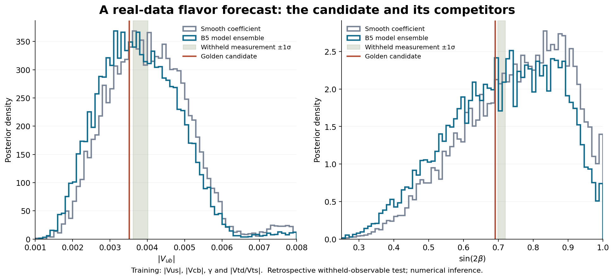

# A real-data B₅ flavor prediction: the golden cyclotomic candidate

The follow-up [vacuum-selection monograph](B5_FLAVOR_VACUUM.md) constructs an explicit rational CP-even potential with global minima at ±66° and a golden-coefficient portal, and measures the coupling relations and sensitivity still needing a physical explanation. It adds a conditional mechanism rather than new fit evidence.

The nominated candidate is

\[
 s_{13}=\phi^{-2}s_{12}s_{23},\qquad \delta=\frac{11\pi}{30}=66^\circ,
 \qquad \phi=\frac{1+\sqrt5}{2}.
\]

With the independently measured anchors |Vus|=0.22431 and |Vcb|=0.0411, it predicts |Vub|=0.00352144, sin(2β)=0.690888 and J=2.88778×10⁻⁵ at the reference inputs. It also predicts β=21.8502°, γ=65.9671° and α=92.1827°. These numbers follow from a unitary three-generation CKM matrix; none of |Vub|, sin(2β), J or α is used to select its coefficient and phase in this experiment. This is a new, explicit phenomenological prediction candidate developed here. It is a retrospective withheld-observable experiment on existing measurements, not a blinded discovery or a derivation of the Standard Model flavor sector.

The candidate came from actual exhaustive lattice inference, not a planted synthetic target. A 61,651-vector rational exponent domain was generated exactly. The declared physical reference range retained 35,196 labeled monomials. Pairing them with 47 rational phase values gives 1,654,212 structural candidates. Every one is evaluated. The five basis quantities are α(0), α_s(MZ), π, φ and m_p/m_e, with named fixed reference definitions. The physical map is a new modification of the old B₅ scaffold: the lattice determines one shared third-generation mixing coefficient C rather than independently fitting arbitrary exponents to every output. This shared coefficient is what makes an unfitted observable possible.

## Physical inputs, prediction target and actual acquisition

The calculation downloads and retains the PDG 2025 CKM matrix review, CKM angle review and QCD review, totaling 2,637,759 bytes. Their URLs and SHA-256 hashes are in `receipts/flavor_prediction/sources/manifest.json`. NIST constants were read through its published text table; a direct executor download returned HTTP403, so the two extracted values and their uncertainties are retained separately. The numbers below refer to these pinned reviews, rather than mixing the particle listings, review-specific lattice estimates and a correlated global CKM fit.

The training anchors are |Vus|=0.22431±0.00085 from Eq. 12.8, |Vcb|=0.0411±0.0012 from Eq. 12.11, |Vtd/Vts|=0.207±0.001±0.003 from Eq. 12.14 and γ=66.4° with −2.8°/+2.7° uncertainty from Eq. 76.15 of the angle review. The strong-coupling anchor is α_s(MZ)=0.1180±0.0009 from the QCD review, Eq. 9.25. The B-mixing extraction of |Vtd/Vts| assumes Standard Model mixing dynamics; this dependence is part of the forecast's physical assumptions. The independent-anchor error model is explicit because a complete covariance matrix across these summary inputs was not supplied.

The withheld comparisons are |Vub|=(3.82±0.20)×10⁻³ from Eq. 12.12 and sin(2β)=0.709±0.011 from Eq. 12.20. The forecast routine accepts exactly the training schema and rejects additional keys, including either withheld target. The runner saves forecast bytes before reading the separate withheld file and records the forecast hashes in its scorecard. This prevents software leakage; it does not make the author blind to already-published measurements. The old finite-Clebsch work had also discussed CKM data, so the present heldout status is confined to this training calculation.

The exact source of the original exponent scaffold is **A monograph on the B₅/C₅ Weyl scaffold behind α-bounded mass ratios**, Library identity `libfile_c6f71648d68c8191bb495e00bc28233d`, read in the preceding revision. The coefficient/angle closure C=5/13, δ=2π/5 is taken as a historical comparator from the separately identified **finite_clebsch_flavor_ansatz_v21 (5).html**, identity `libfile_b183bf47d9e08191944e818c792146d9`; its source formulas and numerical evaluator were inspected. That comparator conditions on the current Vus,Vcb anchors and does not claim to reproduce every mass-dependent component of v21. Its original fitted targets included some of our withheld observables, so it is a historical reference, not a clean independent heldout baseline.

## Why the observable prediction is a cubic

Write u=|Vus|, v=|Vcb| and w=s13=|Vub| in the standard unitary parametrization. Since u=s12 c13 and v=s23 c13, the shared-depth rule w=C s12 s23 becomes

\[
 w(1-w^2)=Cuv.
\]

This retains the c13 factors exactly. Replacing s12 by u and s23 by v would lose the small cubic correction. The numerical chart selects the hierarchical small branch, w<0.061 for its declared anchor domain. On that interval the derivative 1−3w² is positive, so the branch is unique. The code does not claim to describe every nonhierarchical branch of the cubic. Five Newton iterations give residuals below 10⁻¹⁷ in the 101-case chart test. The constructed matrices retain the two anchors and unitarity to ordinary floating-point precision.

For C=(3−√5)/2 the coefficient satisfies C²−3C+1=0. Eliminating C gives the exact conditional observable polynomial

\[
 \boxed{(w-w^3)^2-3uv(w-w^3)+(uv)^2=0.}
\]

The smaller positive coefficient branch must be retained; eliminating a radical alone would also include the conjugate coefficient (3+√5)/2. A measured decimal triplet will generally have a nonzero polynomial residual. The equality is the physical hypothesis to test within measurement uncertainty, not a statement that rounded measurements satisfy an exact integer equation.

## One cyclotomic carrier for both quantities

Let z=exp(11πi/30), a primitive 60th root of unity. Then

\[
 \Phi_{60}(z)=z^{16}+z^{14}-z^{10}-z^8-z^6+z^2+1=0,
 \qquad C=1-z^{12}-z^{-12}=\phi^{-2}.
\]

The phase and coefficient therefore live in one exact algebraic carrier. The exponent 12 sends this chosen root to a primitive fifth root. This is an algebraic compression of the training-selected candidate, not an independently established ultraviolet mechanism. Among CP-positive primitive 60th-root embeddings with the smaller positive coefficient, the indices are 1,11,19,29, corresponding to phases 6°,66°,114°,174°. The γ training anchor favors the second. Negative-CP and large-conjugate-coefficient embeddings are not silently identified with it.

The implementation reuses PerfectPower's existing rational quotient algebra. It constructs the cyclotomic modulus by exact division of xⁿ−1 by its proper divisor factors, then checks C²−3C+1 and z⁶⁰−1 by rational polynomial reduction. It also retains nonzero proper-power remainders, computes norm(C)=1 and trace(C)=24, and reconstructs the full multiplication characteristic polynomial (x²−3x+1)⁸. These are exact executable algebraic identities. The physical interpretation remains a hypothesis; no new Lean formalization is claimed.

## Frozen candidate domain and inference

The exponent alphabet is the reduced set {±1,±2}/{1,2,3,5,12}, together with zero. Support is at most three. There are 1 zero-support, 90 one-support, 3,240 two-support and 58,320 three-support labeled vectors. The prior is proportional to exp(−0.8 support−0.15Σ log reduced_denominator), normalized after conditioning the reference monomial range on C≤2. No signed-permutation quotient discards distinct physical predictions. The phase alphabet contains all reduced p/q in (0,1) with denominators 3,4,5,12,18,30, with a uniform prior over the 47 distinct states. δ=πp/q.

Each candidate determines a complete CKM matrix once the two anchor magnitudes are supplied. The training likelihood uses the mixing ratio and a split-normal γ likelihood. Vus,Vcb and α_s uncertainties are integrated by independent Gaussian Hermite quadrature. Twenty-seven nuisance nodes are used in the main lattice run; the 125-node comparison is retained. Posterior quantiles use seeded conditional categorical samples, preserving paired outputs. The figures contain compact 16,384-draw paired resamples; scorecards are computed from the full inference arrays before that compression.

Once the nominated formula is fixed, its nuisance distribution is computed directly from 262,144 Gaussian anchor draws with training-likelihood weights, avoiding step-like quantiles from a small quadrature grid. Its effective sample size is reported. This conditional calculation deliberately excludes uncertainty over which formula was selected. The full-lattice ensemble supplies that different uncertainty. The two must not be substituted for one another.

The smooth comparator uses a normalized uniform C prior on (0,2), numerical midpoint integration over 2,001 values, and exactly the same finite phase alphabet and likelihood. Consequently the comparison isolates the exponent prior's contribution rather than crediting ordinary CKM unitarity or the phase grid to B₅. It is a declared smooth-prior comparator, not a replacement for CKMfitter or UTfit. Conditional evidence ratios compare normalized specified models; a best-fit penalized score is never called evidence.

## The numerical forecast and what survived testing

Conditional on the golden candidate, the posterior mean is |Vub|=0.00351974. Its central 68% interval is [0.00341661,0.00362296] and its 95% interval is [0.00331674,0.00372365]. The conditional sin(2β) mean is 0.690904, with 68% interval [0.690789,0.691019]. J has mean 2.88756×10⁻⁵, with 68% interval [2.71860,3.05655]×10⁻⁵. These are latent model intervals and do not already include future measurement error. In ordinary approximate Gaussian terms the current |Vub| comparison differs by about 1.3 combined standard deviations and sin(2β) by about 1.6. Neither comparison confirms the model. Improved measurements can resolve the deficits.

Across the whole lattice, |Vub| instead has mean 0.00379421, 68% interval [0.00269346,0.00487603], and 95% interval [0.00194583,0.00595810]. The sin(2β) ensemble interval is similarly much broader, [0.541701,0.879444] at 68%. The leading single exponent formula has only 0.1603% posterior probability in the support-three family. The phase 66° has about 92.17% posterior probability in the specified finite phase alphabet. A favored phase therefore does not uniquely identify five exponents or the golden coefficient.

The golden one-axis formula remains the reference MAP candidate when the sparsity penalty is doubled, when support is restricted to one axis, and when denominator 60 is added to the phase alphabet. With a completely flat exponent prior, a more complicated formula wins the reference MAP comparison. Removing φ selects another simple coefficient and barely changes the broad forecast. Thus the mathematical compression is useful, while indispensability of φ is not established.

The 125-node ensemble mean for |Vub| is 0.003794515, about 0.0081% above the 27-node mean; its conditional evidence differs by about 0.00031%. The sensitivity and integration receipts preserve the actual runs. Model uncertainty, not this integration change, dominates the forecast width.

The conditional training evidence ratio B₅/smooth is about 0.800. The paired posterior-predictive density ratio on the two withheld measurements is about 1.040, with sampling uncertainty recorded in the scorecard. That small result is not a demonstrated predictive advantage. The nominated locked formula has a sharper conditional forecast, but its high conditional training likelihood cannot be treated as discovery evidence after selecting it from the large domain. Every headline number here is accompanied by the relevant uncertainty or model-comparison scope.

## Run and inspect

```sh
PYTHONPATH=python OPENBLAS_NUM_THREADS=1 python python/develop_flavor_prediction.py
PYTHONPATH=python OPENBLAS_NUM_THREADS=1 python python/develop_flavor_prediction.py --only-sensitivity
PYTHONPATH=python python -m unittest discover -s python/tests -p test_flavor_prediction.py -v
PYTHONPATH=python python python/plot_flavor_prediction.py
```

NumPy is required for numerical inference. Matplotlib is needed only to regenerate the scientific figure. Exact exponent and quotient-algebra routines use Python rational arithmetic. The retained inputs, protocol, source originals and hashes, forecast receipts, sensitivity runs, compressed plot draws, heldout scorecard and exact algebraic carrier are in `receipts/flavor_prediction/`. The main runner is deterministic under its recorded numerical runtime and seeds.



The result is a specific flavor hypothesis with three unfitted quantitative consequences, an exact algebraic representation, and an executable physical-data forecast. The present evidence supports continued testing of the candidate, while leaving the mechanism and uniqueness of its arithmetic origin unresolved.
