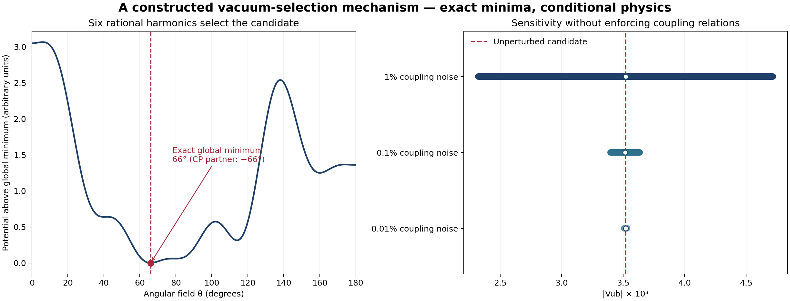

# From a golden CKM formula to a vacuum-selection mechanism

This push constructs an explicit CP-even angular potential whose **only global minima on the full circle are θ=±66°**. A real coefficient coupled to that angle then settles at **C=(3−√5)/2=φ⁻²**. The resulting CKM candidate retains |Vub|=0.00352144218, sin(2β)=0.690888312, J=2.887777392×10⁻⁵ and the unitarity-triangle angle α=92.18269773° at the previous reference anchors. The substantive change is the existence of an energy-minimization construction, with all competing stationary points checked by exact arithmetic, rather than another fit to those numbers.

The construction was developed after knowing the desired coefficient and phase. It is an explicit conditional mechanism, **not an independent explanation of why nature chooses its interactions**. The potential's rational coupling relations, the map from its angular field to the standard CKM phase, and the shared-depth Yukawa rule remain physical hypotheses. This chapter identifies those assumptions quantitatively and supplies machinery for attacking them. Neither the old lattice posterior nor the accuracy of the predicted measurements is promoted to evidence for this new mechanism.



## The potential, without inserting a decimal angle

Up to an irrelevant additive constant, the selected angular potential is

\[
\boxed{U(\theta)=\cos(2\theta)+\frac23\cos(3\theta)
 +\frac25\cos(5\theta)+\frac14\cos(8\theta)
 -\frac29\cos(9\theta)-\frac16\cos(12\theta).}
\]

There are six harmonics and rational coefficients. No measured decimal angle appears. Its torque has equal absolute amplitudes: the derivative is −2sin(2θ)−2sin(3θ)−2sin(5θ)−2sin(8θ)+2sin(9θ)+2sin(12θ). That compact expression is useful for model building, but the choice of harmonics and signs was obtained through construction around the previously nominated order-60 carrier. It must not be presented as a target-independent discovery.

Set x=2cosθ and define

\[
\Psi_{60}(x)=x^8-7x^6+14x^4-8x^2+1.
\]

The polynomial potential implemented in the code includes the constant 11/12 and is

\[
V(x)=-x+\frac32x^2+\frac83x^3-\frac{25}4x^4
-\frac{14}5x^5+\frac{25}3x^6+x^7
-\frac{35}8x^8-\frac19x^9+x^{10}-\frac1{12}x^{12}.
\]

Its derivative factors exactly:

\[
\boxed{V'(x)=\Psi_{60}(x)(-1+3x-x^3).}
\]

Since x³−3x=2cos(3θ), the second factor is −1−2cos(3θ). The stationary angles in the positive half-circle include the eight primitive order-60 conjugates 6°,42°,66°,78°,102°,114°,138°,174°, together with 40°,80°,160° and the endpoints 0°,180°. Thus the potential genuinely contains competitors. Its smallest value is at 66°, approximately −0.2055122433 in this polynomial normalization. The closest other stationary value is at 80°, approximately −0.1454183547. The exact rational enclosure proves an energy separation greater than 0.060; this number is an energy difference between critical values, not a tunneling barrier, scalar mass or dimensional physical scale.

The program first constructs Φ60 from exact divisions of zⁿ−1. It derives the real polynomial through Φ60(z)=z⁸Ψ60(z+z⁻¹), then independently checks that relation in the existing rational quotient algebra. Sturm bisection isolates all eleven interior roots of V′ on x∈[−2,2]. Rational interval evaluation encloses their energies and the two endpoint energies. The winning interval's energy upper bound lies below every competitor's lower bound. Numerical angle labels are added only afterward. This proves the global winner in x using exact executable arithmetic; the conventional cyclotomic root correspondence identifies its angle as 66°. No new Lean theorem is claimed.

Because U is CP-even, U(θ)=U(−θ). The two full-circle minima are therefore ±66°. The construction produces spontaneous CP breaking if the angular field is physically CP-conjugated and its vacuum feeds the quark sector. It cannot prefer the observed sign without an initial-state selection, a cosmological account, or additional CP-breaking input. Assigning positive CP by convention does not solve that selection problem.

## Getting the golden coefficient from the same vacuum

Introduce a real dimensionless coefficient C and the nonnegative coupling

\[
\mathcal U(\theta,C)=U(\theta)
 +\kappa\,[C-1+2\cos(12\theta)]^2,\qquad \kappa>0.
\]

At either global angular minimum this second term can vanish with C=1−2cos(12θ)=1−2cos72°=(3−√5)/2. Since U already has its global minimum there and the additional term is nonnegative, the combined potential has the same globally minimizing angle and the golden coefficient. Restricting C to the previous physical chart [0,2] does not invalidate this minimum. The source of the twelfth-harmonic coupling is still an operator-selection assumption; its existence is shown, its origin is not derived.

The local joint stability is also explicit. Let h=U″(66°)≈12.20924242 and f′=24sin(12θ)≈22.82535639. In coordinates (θ,C), the Hessian at the minimum is

\[
H=\begin{pmatrix}h+2\kappa f'^2&-2\kappa f'\\-2\kappa f'&2\kappa\end{pmatrix},
\qquad \det H=2\kappa h>0.
\]

Both directions are stable for every positive κ. These entries are dimensionless curvatures in the stated coordinates. Kinetic normalizations and physical scales would be required before calling their eigenvalues particle masses. A radial flavon completion, messenger fields, allowed Yukawa operators and quantum corrections have not been supplied by this Hessian calculation.

The proposed quark portal remains s13=C s12 s23, δ=θ, with independently supplied |Vus| and |Vcb|. The exact CKM-coordinate equation w−w³=Cuv retains the c13 factors. The existing unitary chart computes all consequences. The new runner reads the reference training file but uses only u and v; γ, |Vtd/Vts| and both withheld observables do not enter its numerical potential search or minimum calculation. However, order60 and the desire to recover the earlier candidate were known before construction. This is mathematical reverse construction with physical consequences, not a new blinded prediction protocol.

The phase portal also gives an exact relation using only four rephasing-invariant squared magnitudes. Put U=|Vus|², V=|Vcb|², W=|Vub|², D=|Vtd|², S=1−W, A=[UV+W(S−U)(S−V)−DS²]² and B=4UV(S−U)(S−V)W. Standard CKM unitarity gives cos²δ=A/B. Define F(q)=−1+144q−1680q²+7168q³−13824q⁴+12288q⁵−4096q⁶ and its homogeneous form H=B⁶F(A/B). Eliminating the coefficient and phase yields the exact polynomial necessary condition

\[
\boxed{UVH^2-WS^2B^{12}=0.}
\]

This total-degree-at-most-74 polynomial is evaluated with rational arithmetic and no transcendental phase extraction. It supplies an additional reusable connection to PerfectPower's exact-constraint machinery. Eliminating and squaring creates extra branches: one must still impose physical CKM compatibility, positive coefficient, the CP choice and the selected vacuum. The numerical diagnostic independently reconstructs the normalized portal residual from magnitudes and checks rephasing invariance. Rounded experimental values generally have a nonzero residual; the expression is a model hypothesis to assess with uncertainty, not a claim that measured decimals satisfy it exactly.

## A separate spectral reason the coefficient is simple

There is an additional conditional minimality result for C. Consider a positive definite symmetric integral matrix A=[[a,b],[b,d]] with determinant one and canonical Euclidean kinetic coordinates. Its two eigenvalues satisfy λ²−Tλ+1=0, with integer trace T=a+d. Trace two forces A=I. Every nontrivial matrix therefore has T≥3, and its smaller eigenvalue

\[
\lambda_-(T)=\frac{T-\sqrt{T^2-4}}2
\]

decreases as T increases. The **largest subunit eigenvalue of a nontrivial matrix in this class is φ⁻²**, achieved exactly at trace three. The four extremizing matrices are [[2,1],[1,1]], [[2,−1],[−1,1]] and their coordinate swaps. The bounded integer census retains every qualifying matrix with diagonal entries at most twelve and off-diagonal magnitude at most twelve; the trace argument establishes the result beyond that box.

The simplest positive example is A=FᵀF with F=[[1,1],[1,0]], the Fibonacci transfer matrix. A real doublet q with potential λ(||q||²−f²)²/4+κqᵀAq/2 aligns with A's smaller-eigenvalue direction whenever λ,κ>0 and f²>κλ−/λ. Its nonzero radial minimum satisfies ||q||²=f²−κλ−/λ; the radial curvature is 2λ||q||² and the transverse curvature is κ√5. This is a concrete way to obtain the golden eigenmode dynamically. Identifying its normalized Rayleigh value with the CKM coefficient still requires a portal.

The integral basis and canonical kinetic metric matter: a nonorthogonal integral coordinate change also changes the kinetic metric. This spectral argument is not a coordinate-free mandate that all flavor theories contain φ. Nor does it explain why the matrix is integral, why determinant one is imposed, or why the weakest nontrivial attenuation is chosen. It supplies a minimal discrete spectral candidate with explicit assumptions, separate from the phase portal above.

## What the original B₅ symmetry can and cannot do

The full W(B₅) signed-permutation group has 3,840 elements. The executable exact census gives element orders {1,2,3,4,5,6,8,10,12}, with no element of order 60 or any order divisible by 60. A primitive 60th-root eigenvalue would force the element's order to be divisible by 60, so it cannot be produced by a single element in this group. The exact signed-cycle calculation finds that dimension ten is the smallest W(Bn) signed-permutation dimension supporting order60: cycles of lengths two, three and five with orders four, three and five achieve it.

There is a second rational-representation obstruction: a primitive 60th root has minimal polynomial degree sixteen, so a rational matrix with that eigenvalue needs at least sixteen dimensions. This is narrower than a prohibition on ordinary complex flavor representations. A complex one-dimensional representation of C60 has no such difficulty, and CKM phases arising from several sectors or Clebsch coefficients need not equal a single W(B₅) eigenphase. The obstruction prevents an invalid direct symmetry claim; it does not rule out every B₅-inspired construction.

Similarly, rational polynomial equations alone cannot select one primitive order-60 conjugate. A rational polynomial vanishing at one primitive root is divisible by Φ60 and vanishes at all its Galois conjugates. Energy inequalities can discriminate among those roots, as our potential does. That distinction explains why an algebraic carrier, a phase-locking equation and a selected physical vacuum are three different achievements.

## How much structure must be enforced?

For a nonconstant rational CP-even potential with harmonics up to m, stationarity at a primitive 60th-root angle means that its x-derivative is divisible by Ψ60. Since Ψ60 has degree eight, no nonconstant rational cosine potential with m≤8 can have that exact stationary phase. Harmonic nine is the first possible degree. The simplest antiderivative V′=Ψ60 does have a stationary point at 66°, but its global minimum is 138°; exact stationarity is insufficient.

With twelve independent nonconstant cosine coefficients, stationarity imposes **eight independent rational linear relations**, leaving a four-dimensional family. Our selected sparse support {2,3,5,8,9,12} has **four independent relations among six coefficients**, leaving two dimensions. These ranks are computed by exact rational elimination, and the actual coupling vector is checked in the constraint kernel. There is therefore a precise protection problem for a UV model: enforce the missing harmonics and these relations, not merely allow a 60th root somewhere in a group.

The present angular potential has harmonic gcd one and possesses no nontrivial rotation symmetry of the form θ→θ+2π/n. CP alone permits every cosine harmonic and does not enforce the relations. A C60-invariant one-field potential would instead repeat the energy along its entire rotation orbit, failing to select one of its symmetry-related vacua. A faithful mechanism needs a more specific interacting field sector, residual-symmetry structure, or protected operator relation. None is silently inferred from the existence of the potential.

The declared selector census evaluates every primitive integer multiplier Q(x) of degree at most three with coefficients in [−3,3]. There are 2,240 distinct signed coefficient vectors after removing nonprimitive rescalings. Four give a single positive-half-circle global winner at 66° in the numerical census, with minimum coefficient l1 cost five. The selected Q=−1+3x−x³ has that cost and the especially simple form −1−2cos3θ. The complete census retains every result and accepts no target angle as input. Its classifications are numerical; the selected potential and two comparison potentials receive separate exact root/energy calculations. This is a bounded construction search, not a probability that nature picks the winner.

## Sensitivity, occupation and actual selection

Two kinds of perturbation behave differently. Changing Q while retaining the factor Ψ60 leaves all primitive order-60 angles exactly stationary. In the stated seeded perturbation scenario, all 512 one-percent multiplier perturbations retained 66° as the global winner; approximately 93.6% of five-percent perturbations and 75.6% of ten-percent perturbations did so. Those are frequencies in a declared hypothetical coupling-noise distribution, not posterior probabilities of theories or estimates of loop corrections. They show an open region of energy preference within the common-factor family.

Independent perturbations to all twelve Fourier coordinates break that factor. For a added term εcos(nθ), the local phase response is dθ/dε=n sin(nθ)/U″(θ). The coefficient then responds through dC/dθ=24sin(12θ), approximately 22.825 per radian at the nominated vacuum. A modest angular shift can therefore change the mixing coefficient substantially. The Laurent stationary-root calculation recomputes the global minimum for 2,048 paired seeded draws at each declared noise size.

At 0.01% total RMS Fourier noise, the central 68% phase interval is approximately [65.9966°,66.0031°], and |Vub| spans [0.0035090,0.0035328] at fixed anchors. At 0.1% it spans [0.0033974,0.0036354]. At 1% the phase interval remains relatively narrow, approximately [65.6698°,66.3222°], while |Vub| spans [0.0023243,0.0047170] among draws in the physical chart. One of the 2,048 one-percent draws leaves that chart. These are coupling-sensitivity intervals, not replacements for the previous input-error posterior or the full lattice model uncertainty.

Global minimality also does not establish a cosmological history. With uniform initial angle and overdamped zero-temperature descent on the uncoupled angular potential, the 66° attraction basin occupies only 20% of the positive half-circle. Several higher local minima can trap the field. Illustrative canonical Gibbs occupation instead gives the 66° basin about 71.8%,82.0%,95.5%,99.7% probability at dimensionless temperatures 0.1,0.05,0.02,0.01 respectively. The negative-CP partner has equal occupation on the full circle. These examples assume a specified angular measure and do not determine the universe's temperature history, tunneling rate or domain structure. They separate energy preference from successful dynamical arrival.

## Relation to established flavor constructions

Alonso, Gavela, Merlo and Rigolin's *On the Potential of Minimal Flavour Violation*, [arXiv:1103.2915](https://arxiv.org/abs/1103.2915), examines dynamical Yukawa backgrounds and distinguishes the behavior of bifundamental and fundamental scalar constructions. Its simplest renormalizable bifundamental setting does not naturally generate quark mixing. This supports testing an actual scalar/portal sector rather than treating an invariant or an attractive number as a complete origin. The present construction does not reproduce that paper's full potential or supply the missing scalar representations.

Antusch, King, Luhn and Spinrath's [arXiv:1103.5930](https://arxiv.org/abs/1103.5930), especially Eqs. 2.2–2.5, provides a concrete driving-field approach to discrete flavon phases. Antusch, Holthausen, Schmidt and Spinrath's [arXiv:1307.0710](https://arxiv.org/abs/1307.0710) connects discrete symmetry, spontaneous CP breaking and controlled mass-matrix determinants. These are useful precedents for what a fuller field-theoretic construction must include; they do not derive our golden coefficient or 66° phase.

Lu and Ding's [arXiv:1901.07414](https://arxiv.org/abs/1901.07414) constructs quark/lepton patterns from dihedral symmetry and generalized CP with residual subgroups and continuous parameters. That comparison matters because a group name alone does not fix a CKM matrix. Four primary-source PDFs were automatically acquired and relevant sections read for this push; their retrieval hashes, byte counts and reading locations are retained in `receipts/flavor_vacuum/sources.json`. No additional experimental measurement has been introduced as a fit target.

## Quark matrices and the remaining physical gap

The executable existence embedding Yu=diag(yu), Yd=V diag(yd), for arbitrary positive spectra, produces the candidate CKM matrix upon left diagonalization. Tests independently check its Jarlskog commutator identity and rephasing-invariant observables. Since the standard V has determinant one, the determinants can be real at tree level in this chosen basis. This observation does not solve strong CP: θQCD, allowed UV interactions, radiative corrections and the symmetry protecting the determinant must all be controlled. Masses are supplied freely here, and no mass hierarchy or renormalization-group evolution is derived.

We now have a concrete answer to a narrower version of the user's question: **a specified energy landscape can choose the nominated angle and coefficient, with positive local stability and exact global selection**. What remains unexplained is why nature implements that landscape and portal. The coupling-rank and sensitivity calculations make that question more exact. A successful next mechanism must generate the six-harmonic pattern or another protected common-factor family, map its CP-breaking vacuum into gauge-invariant quark operators, preserve the forecast under quantum corrections, and account for vacuum occupation. Until then the model remains a falsifiable phenomenological candidate with a constructed dynamical realization.

## Reproduce and reuse

```sh
PYTHONPATH=python OPENBLAS_NUM_THREADS=1 python python/develop_flavor_vacuum.py
PYTHONPATH=python OPENBLAS_NUM_THREADS=1 python python/plot_flavor_vacuum.py
PYTHONPATH=python OPENBLAS_NUM_THREADS=1 python -m unittest discover -s python/tests -p test_flavor_vacuum.py -v
```

The exact cyclotomic, Fourier, rational constraint and Sturm/energy operations use the standard library and existing PerfectPower algebra. Numerical censuses and perturbations require NumPy. Matplotlib regenerates the figure; SciPy is used only for an independent minimization cross-check in the tests. The new `cyclotomic_vacuum` module is reusable beyond this flavor candidate: it constructs rational phase-stationary families, counts the coupling constraints, and compares all global-minimum candidates without assuming that a requested root is the winner. The prior physical prediction, its source inputs and its broad formula uncertainty remain documented in [B5_FLAVOR_PREDICTION.md](B5_FLAVOR_PREDICTION.md).
