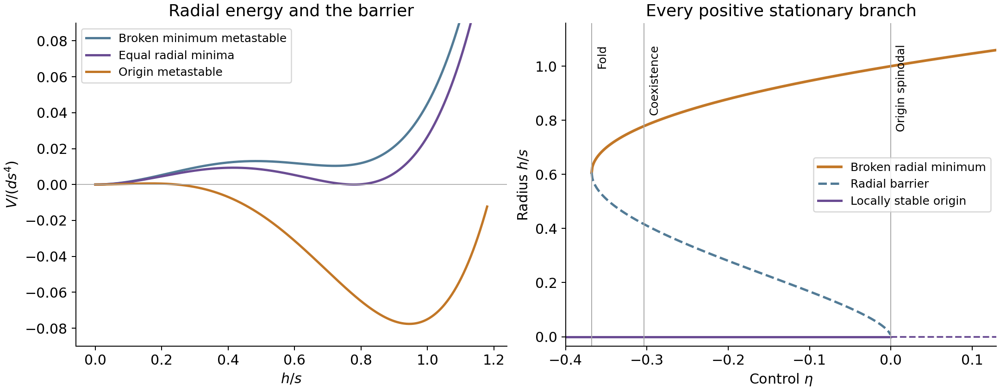

# Analytic radial geometry and source response

## The mathematical advance

The fixed-gauge Higgs sector now has a complete one-dimensional stationary and energy classification, an analytic compiler from the declared mediator action, and a 48-coordinate local source solver. Its logarithmic quartic has a universal normal form. Both real Lambert W branches recover every nonzero radial stationary point; the second branch carries the barrier that a principal-branch-only calculation would miss. Exact derivative and energy identities give the fold, degenerate minima, metastable regions and radial response. A Schur complement then eliminates the stable radial coordinate from the coupled curvature without confusing radial stiffness with frame selection.

Applied to the existing calibrated hard potential, the new 48-coordinate algorithm reaches the same local branch as the independent 49-coordinate algorithm to about one part in ten billion in absolute coordinates. Its reduced curvature is positive. These are new mathematical tools and a second solution method for the specified local action. The global classification applies to the one-dimensional slice, not to the entire flavor vacuum. The finite Higgs mass input, gauge convention and unresolved radial power-counting issue remain exactly those of the preceding fixed-gauge calculation.

## Compiling the actual radial polynomial

Fix the other 48 canonical fields. The Higgs enters the tree action only through h squared. The source portals are quadratic in h, and every mediator current is J(h)=J0+c_h h squared/2. Completing the mediator squares adds a nonnegative quartic contact. The centered singlet portal adds another quadratic term at fixed singlet displacement. Consequently the full fixed-coordinate tree potential is V0+B h squared/2+lambda h fourth/4, even in the non-Gaussian singlet completion.

Let F0=sigma+J0/M squared, t_sigma be the singlet displacement, q be the eight quadratic source invariants, p their Higgs portals and k_H the singlet-Higgs portal coefficient. Direct contraction gives B=-mu_H squared+p dot q+c_h dot F0+t_sigma squared k_H/2 and lambda=0.13+norm(c_h) squared/(2 M squared). The compiler evaluates these contractions directly. It does not reconstruct coefficients from a fitted radial scan or differentiate small differences of loop energies. In the retained benchmark lambda=0.130008 and B=-0.0002340144 at the tree vacuum.

For fixed gauge couplings, define C_i=n_i a_i squared/(64 pi squared r), where a_W=g squared/4, a_Z=(g squared+gprime squared)/4 and n_W=6,n_Z=3. Set d=4 sum C_i, and retain the preceding finite quadratic mass calibration delta_mu2. With reference radius h0, put alpha=lambda+4 sum C_i[log(a_i h0 squared/(r mu squared))-1/3]. The normal scale is s squared=h0 squared exp(-alpha/d), and the control is eta=-(B-delta_mu2)/(d s squared). Apart from a field-independent constant, the exact tree-plus-vector radial slice becomes V(h)=d s fourth[y squared(log y-1/2)-2 eta y]/4, with y=h squared/s squared. The compiler requires d>0; the zero-vector polynomial limit belongs to a separate polynomial solver.

The benchmark maps to d approximately 785.825225, s squared approximately 0.0000116791897 and eta approximately 776.416876. Its normal form lies well inside the broken-only radial region. Scalar and quark Coleman-Weinberg determinants are not part of this analytic compiler: their dependence on the full mass matrices is a separately evaluated numerical remainder. This distinction permits exact radial seeding without asserting a closed-form solution of all 49-field loop equations.

## Every branch, energy and barrier

Differentiation gives V_h=d h s squared[y log y-eta]. Thus h=0 is always stationary, and every nonzero stationary radius obeys y log y=eta. Equivalently y=exp(W0(eta)) or exp(W-1(eta)), where the two real branches coexist for -1/e<eta<0. At eta=-1/e they meet at y=1/e. For eta>=0 only the principal branch gives a nonzero radius. For eta<-1/e no nonzero stationary point exists. The NIST Digital Library of Mathematical Functions supplies the standard real-branch conventions; the potential identities and classification follow directly from this normal form.

At a nonzero stationary point, the energy relative to the origin is -d s fourth y(eta+y/2)/4. The radial curvature is 2 d s squared y[1+W(eta)]. The principal branch is therefore a radial minimum, while W-1 is the radial maximum separating the origin and the broken branch. Its energy gives the barrier from the origin; subtracting the broken minimum energy gives the reverse barrier. The origin has curvature -d s squared eta. At eta=0 its quadratic curvature vanishes, but h fourth log(h squared) makes it locally unstable rather than an additional minimum.

Equal origin and broken energies require eta=-y/2 together with y log y=eta. Hence the coexistence point is exactly eta=-1/(2 sqrt(e)), with y=1/sqrt(e). The ratio of coexistence control to fold control is sqrt(e)/2. These constants arise from the logarithmic-quartic shape, not from a fitted CKM relation. They do not supply a golden coefficient or a physical 66-degree phase.

Below the fold, the origin is the only minimum. Between the fold and coexistence, a metastable broken minimum appears behind a radial barrier while the origin remains the global minimum. At coexistence their energies agree. Between coexistence and zero, the broken branch is the global radial minimum and the origin is metastable. At zero the origin loses local stability, and above zero only the broken minimum is stable. The potential grows without bound for large absolute h because d>0, so the stationary-energy comparison completes the global one-dimensional classification. Signed h gives symmetric positive and negative solutions mathematically. For the Higgs doublet those signs are gauge-equivalent descriptions of the same radius; they are not two CP vacua.

The figure shows the dimensionless potential across coexistence and every positive stationary branch. It represents the conditional radial normal form, not a cosmological transition temperature or a global flavor phase diagram.

## Response and the fold singularity

Implicit differentiation gives dy/deta=1/[1+W0(eta)] on the stable broken branch, and dh/deta=s/[2 sqrt(y)(1+W0(eta))]. The response diverges at the fold. This is the precise condition under which radial elimination ceases to be a stable smooth operation: zero radial curvature invalidates the inverse used by the local implicit-function theorem. Near a fold, a small parameter displacement need not produce a small vacuum displacement.

The envelope derivative of the minimum energy is -d s fourth y/2, and its second derivative is -d s fourth/[2(1+W0(eta))]. The code evaluates the analytic branches with 60-digit special-function arithmetic and returns floating-point numerical quantities. Named critical inputs denote the exact analytic fold, coexistence and origin boundaries. Ordinary floating inputs keep their supplied value rather than being silently rounded into a critical class. This is high-precision evaluation of exact formulas, not interval-certified numerical bounds.

## Eliminating the radial field from the coupled action

Order the local Hessian as a source/mediator block A, a radial cross column b and a positive radial entry c. The derivative of the profiled radius with respect to the remaining coordinates is -b transpose/c. The reduced potential curvature is S=A-b b transpose/c. A triangular coordinate transformation sends the full Hessian by congruence to diag(S,c). Thus positive full curvature is equivalent to c>0 and positive reduced curvature, and the number of negative modes is preserved by the corresponding inertia identity.

If a direct radial contribution adds k>=0 to c while leaving A and b fixed, S(c+k)-S(c)=k b b transpose/[c(c+k)]. This is positive semidefinite and has rank at most one. Increasing radial stiffness suppresses the radial response and monotonically raises the reduced source curvature. It does not create an independent family-frame interaction. The statement is local at a fixed background; moving the vacuum can also change A and b, so it is not a blanket monotonic theorem for a whole parameter scan.

At the previous full hard branch, direct vector stiffness changes the radial-response norm from approximately 3.62519 to 0.0000993567. The reduced curvature shift has one nonzero eigenvalue approximately 0.00615202. The analytic rank-one identity agrees with the numerical Schur difference to about 1.2 times ten to the minus fourteen. The triangular congruence removes the radial cross block to about four times ten to the minus twenty-two, and the reduced 48-field curvature remains positive. These checks concern the complete local hard Hessian, including the scalar and quark loop remainder, not merely a detached toy quartic.

## A second solver for the same local action

For each current set of 48 source/mediator coordinates, the new algorithm compiles and selects the positive Lambert radial minimum of the tree-plus-vector slice. It refines that radius with the neutral-scalar/quark loop force, then updates the remaining 48 coordinates with the Schur complement of the complete hard Hessian. Repeating this procedure solves the same finite-Higgs-mass-calibrated potential as the earlier 49-coordinate iteration, with the same inputs and no new fitted angle or quark constraint.

The retained weak point converges with a rescaled tadpole residual below ten to the minus fourteen. The minimum reduced and full curvatures are both approximately 1.12549 times ten to the minus five. The coordinates agree with the independent full solver within ten to the minus ten in absolute value. The neutral/quark loop refinement changes the analytic radial seed by about 2.55 times ten to the minus ten. This demonstrates that the analytically solved radial component is useful inside the actual coupled calculation. It does not establish a global 49-field minimum or complete quantum pole matching.

## Reproduction and physical boundary

Run PYTHONPATH=python OPENBLAS_NUM_THREADS=1 python python/develop_flavor_radial_profile.py. The receipt includes all seven universal phase classes, stationary points, barriers, control derivatives, compiled mediator coefficients, the local congruence and rank-one checks, and the second coupled solve. Tests independently differentiate the potential, reconstruct the full tree-plus-vector slice, compare profiled radial responses with nonlinear minimization and compare the two source solvers.

The mathematical tools are reusable wherever a positive logarithmic quartic supplies a radial field: complete branch enumeration, exact energy comparison, fold-aware response and reduced Hessians. Their current flavor application removes a numerical radial search and explains the observed stiffness. The physically consistent dressed radial expansion, gauge-independent current and pole matching, global CP selection and representation-derived golden-frame correlation remain separate from the solved mathematics. Lambert W reference: NIST DLMF section 4.13, https://dlmf.nist.gov/4.13. The vector convention is Stephen P. Martin, Phys. Rev. D 65, 116003 (2002), https://arxiv.org/abs/hep-ph/0111209.
