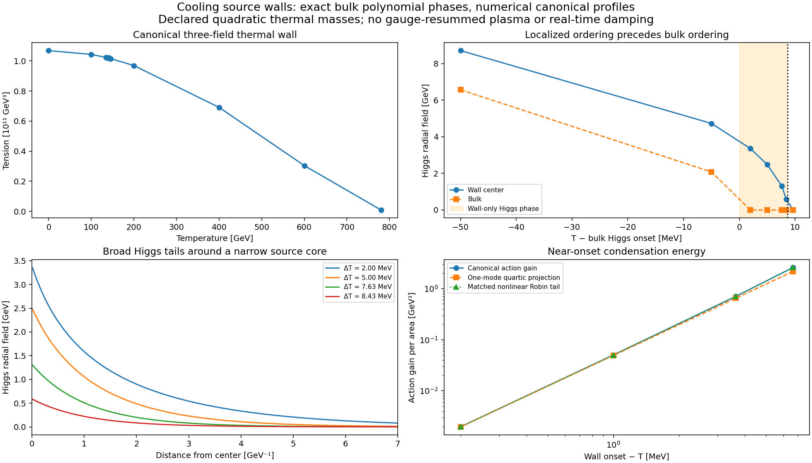

# Cooling walls and a localized Higgs phase

This advance connects the previous high-temperature source-formation benchmark to **canonical source–singlet–radial-Higgs static profiles during cooling**. It also exposes an additional phase in the declared thermal mass model: a Higgs condensate forms on the source wall before the bulk Higgs orders. The bulk polynomial classification is exact, the reduced-kink localization mechanism has an exact factorization, and the canonical thermal profiles and onset are numerical. The calculation does not evolve the Higgs transition in real time or replace the thermal plasma by a derived bath.

The model's source-ordering temperature is 796.415493725 GeV. The bulk Higgs ordering temperature is 140.266457855 GeV. A canonical source–singlet profile followed by zero-mode shooting gives a wall Higgs onset of 140.275087858 GeV, leaving a **wall-only Higgs window of about 8.630 MeV**. At 140.271457855 GeV the continued positive wall branch has a central Higgs value of 2.484296711 GeV while the bulk value is zero. Its action is lower than the uncondensed wall by approximately 0.703085 GeV³ per area.

These numbers are conditional on the explicit leading quadratic thermal masses below. They are not predictions of the full gauge-resummed electroweak thermal theory. In particular, this narrow temperature window has not been tested against quantum, gauge or thermal effective-action corrections.



## Declared potential and exact bulk ordering

Use canonical fields $\phi=vu$, $S=vy$, and $h_{\rm phys}=vh$, with $v=30000$ GeV, and the dimensionless potential

$$
\Phi=\frac\lambda4(u^2-1)^2+
\frac{\mu^2}{2}\left(y+\frac{\alpha u^2}{\mu^2}\right)^2+
\frac H4\left[h^2-h_0^2+\frac\kappa H(u^2-1)\right]^2+
\frac{T^2}{2v^2}(cu^2+c_Hh^2).
$$

The inputs remain $\lambda=1.76188164948\times10^{-5}$, $H=0.13$, $h_0=0.0082$, $\kappa=10^{-7}$, $\alpha=0.1$, $\mu=10$, $c=0.025$, and $c_H=0.4$. The physical potential is $v^4\Phi$. There is no bias, so source vacua remain degenerate and static walls exist. The added thermal terms are a declared mean-field completion, rather than an output of matching a microscopic collision bath. The previous stochastic formation bath's damping and noise do not enter this static problem.

Eliminate $y=-\alpha u^2/\mu^2$ in the homogeneous potential and set $U=u^2$, $Z=h^2$. The remaining potential is a quadratic polynomial on $U,Z\geq0$. Its Hessian is

$$
\frac12\begin{pmatrix}\lambda_e&\kappa\\\kappa&H\end{pmatrix},
\qquad \lambda_e=\lambda+\kappa^2/H,
\qquad \det=\lambda H/4>0.
$$

It is strictly convex. The nonnegative-quadrant KKT conditions therefore classify the unique squared-field **global bulk minimum**, rather than just finding stationary points by a scan. Source signs produce the two CP-related vacua; radial Higgs signs are not counted as distinct gauge vacua. The singlet is unique once the source is fixed.

On the broken-Higgs branch, with $c_e=c-\kappa c_H/H$,

$$
U=1-\frac{c_eT^2}{\lambda v^2},\qquad
Z=h_0^2+\frac\kappa H(1-U)-\frac{c_HT^2}{Hv^2}.
$$

On the restored-Higgs, source-broken branch,

$$
U=A-BT^2,\quad Z=0,\qquad
A=1+\frac{\kappa h_0^2}{\lambda_e},\quad B=\frac c{\lambda_e v^2}.
$$

Above the source transition both squared fields vanish. For this input family the exact rational temperature squares are

$$
T_{H,\mathrm{bulk}}^2=\frac{37539839693934279}{1908028045270}\;\mathrm{GeV}^2,
\qquad
T_{\mathrm{source}}^2=\frac{5153505813999}{8125000}\;\mathrm{GeV}^2.
$$

Their ordering, positivity, and the required branch slopes are checked before square roots are taken. The classical bulk changes are continuous; this polynomial mass model does not generate a first-order bulk barrier by itself.

For stable energy integration, let $a^2=U_{\rm bulk}$, $b^2=Z_{\rm bulk}$, $A_u=u^2-a^2$, $B_h=h^2-b^2$, and $R=y+\alpha u^2/\mu^2$. When both source and Higgs are broken, the exact excess potential is

$$
\Phi-\Phi_{\rm bulk}
=\frac{\lambda_e}{4}A_u^2+\frac\kappa2 A_uB_h+
\frac H4 B_h^2+\frac{\mu^2}{2}R^2.
$$

On $b=0$, add $m_{H,\infty}^2h^2/(2v^2)$, where

$$
m_{H,\infty}^2=v^2[-Hh_0^2+\kappa(a^2-1)]+c_HT^2.
$$

On the both-restored branch, retain the source KKT linear term as well. These formulas avoid subtracting two large thermal vacuum constants. Seventeen exact identities check this classification, excess-potential algebra, the localization and nonlinear-tail formulas, the small-action subtraction, and six cubic vertices.

## Why the wall orders first

First neglect the singlet's induced kinetic correction, while retaining its exact potential elimination. The Higgs-restored source kink is

$$
u(z)=a\tanh(kz),\qquad k=v a\sqrt{\lambda_e/2}.
$$

The Higgs fluctuation operator is

$$
L_H=-\partial_z^2+m_{H,\infty}^2-
\kappa v^2a^2\operatorname{sech}^2(kz).
$$

Define $\nu>0$ by $\nu(\nu+1)=2\kappa/\lambda_e$, hence

$$
\nu=\frac{\sqrt{1+8\kappa/\lambda_e}-1}{2}=0.011225488615.
$$

The nodeless eigenfunction $\psi=\operatorname{sech}^{\nu}(kz)$ has eigenvalue

$$
E_0=m_{H,\infty}^2-k^2\nu^2.
$$

The identity

$$
L_H-E_0=(-\partial_z+\nu k\tanh(kz))
(\partial_z+\nu k\tanh(kz))
$$

makes this the exact bottom of the reduced-kink operator. At bulk ordering $m_{H,\infty}^2=0$, but $E_0<0$ whenever the portal is positive. Thus this declared model has a wall localization instability at a higher temperature than its bulk instability. The limit $\kappa=0$ removes the wall-only interval.

Writing $D=c_H-\kappa c/\lambda_e$ and $N=v^2[Hh_0^2-\kappa(A-1)]$, the analytic onset is

$$
T_{H,\mathrm{wall,ref}}^2=
\frac{N+\lambda_e v^2A\nu^2/2}{D+c\nu^2/2}.
$$

It is 140.275087846830 GeV. This is an exact formula for the specified reduced kink, rather than an exact canonical three-field temperature.

For the canonical calculation the singlet is kept as a field. The source and singlet solve their coupled static equations with the Higgs fixed to zero and the correct thermal bulk values. The Higgs zero-mode logarithmic derivative $r=\psi'/\psi$ is integrated inward from the decaying tail, with $r'=V_H-r^2$. The even zero mode requires $r(0)=0$. This gives 140.275087857654 GeV. Increasing the source tail length from 16 to 20 and tightening the BVP tolerance from $2\times10^{-10}$ to $5\times10^{-11}$ leaves the displayed root unchanged. The difference from the analytic reference is about $1.08\times10^{-8}$ GeV. These are finite-tail numerical controls, not interval enclosures of an exact threshold.

## Canonical thermal profiles and small energy differences

The continuation solves the full canonical source, singlet and radial-Higgs static equations on a reflection half-line. At the center the source is odd and the other two fields are even; at the far boundary all fields take their exact thermal bulk values. Continuing the positive Higgs branch from lower temperatures avoids accidentally selecting the $h=0$ saddle inside the wall-only interval. Sixteen profiles cover temperatures from zero to 780 GeV. Three tighter, longer-box controls sample zero temperature, the wall-only phase, and 600 GeV.

| Temperature [GeV] | Central Higgs [GeV] | Tension [GeV³] |
|---:|---:|---:|
| 0 | 246.949848 | 1.06850373104×10¹¹ |
| 100 | 173.628721 | 1.04333489329×10¹¹ |
| 140.271457855 | 2.484297 | 1.01917243703×10¹¹ |
| 600 | 0 | 3.03838424504×10¹⁰ |
| 780 | 0 | 8.80529662865×10⁸ |

The thermal Higgs tail can extend over several GeV⁻¹ while the source core is roughly 0.01 GeV⁻¹. A domain that resolves only the source width would miss the Higgs condensation and its energy.

Directly subtracting tensions near $10^{11}$ GeV³ is unsuitable for resolving a gain as small as $10^{-3}$ GeV³. Instead write the condensed source/singlet profile as a perturbation of the uncondensed canonical profile. Expand its polynomial energy exactly and remove the linear Euler–Lagrange variation by integration by parts. Integrate the quadratic and higher polynomial remainder together with the Higgs energy; retain the actual reference spline's residual and boundary flux. The exact Taylor identity is checked symbolically. This resolves the following paired action differences:

| $T-T_{H,\mathrm{bulk}}$ [MeV] | Central Higgs [GeV] | Canonical action difference [GeV³] |
|---:|---:|---:|
| 2.000 | 3.357409 | −2.579446 |
| 5.000 | 2.484297 | −0.703085 |
| 7.630 | 1.303924 | −0.0502063 |
| 8.430 | 0.583134 | −0.00197617 |

All four computed condensates lower the wall action. At the 5 MeV point, the refined action difference is −0.703084591350 GeV³, compared with −0.703084590846 in the base run. Full tensions change by less than 0.007 GeV³ in the three refinement controls; the paired difference is substantially more stable than a subtraction of those total tensions. Quadrature estimates in the receipt measure integration error only and do not certify BVP error or stability against every coupled fluctuation. The nonlinear branch is numerically preferred over the $h=0$ wall at these points; a global classification of every possible spatial wall solution is not claimed.

## A nonlinear defect reduction without fitted couplings

A one-mode quartic Landau approximation using the exact linear eigenfunction predicts the central amplitude well here, but underestimates the action gain by about 16% at the 2 MeV point. The spatial tail changes nonlinearly, so retaining a frozen linear eigenfunction in the quartic functional loses information.

A more useful reduction replaces the narrow source core by an attractive Robin defect and solves the nonlinear tail exactly. Match its Robin strength to the analytic linear binding, $q=k\nu$, without fitting it to a numerical condensate. On either side of the defect the radial field $H_r=h_{\rm phys}$ satisfies

$$
H_r''=m^2H_r+H H_r^3,\qquad
H_r'(0^+)=-qH_r(0),\qquad m=m_{H,\infty}>0.
$$

For $q>m$ its exact decaying solution and central value are

$$
H_r(z)=\sqrt{\frac{2m^2}{H}}\operatorname{csch}
\left[m|z|+\operatorname{artanh}(m/q)\right],
\qquad H_r(0)^2=\frac{2(q^2-m^2)}H.
$$

Including the defect energy $-qH_r(0)^2$, the exact action gain is

$$
\Delta\sigma_{\rm Robin}=-\frac{2}{3H}(q-m)^2(q+2m).
$$

The formula smoothly approaches an algebraic tail as $m\to0$ and gives quadratic energy onset as $q\to m$. It is exact for the Robin model, while replacing a finite-width source core by that defect is an approximation. The linear spectral match does not make its nonlinear functional exact for the canonical wall.

| Bulk temperature offset [MeV] | Canonical gain magnitude [GeV³] | Robin gain magnitude [GeV³] |
|---:|---:|---:|
| 2.000 | 2.579446 | 2.578585 |
| 5.000 | 0.703085 | 0.702825 |
| 7.630 | 0.0502063 | 0.0501858 |
| 8.430 | 0.00197617 | 0.00197518 |

The Robin action predictions differ by about 0.034–0.050% in these samples, even though their central amplitudes differ by about 0.75%. This is observed accuracy for this weak-portal family, not a uniform approximation bound. It supplies a compact nonlinear wall-ordering model that carries more information than the frozen-mode quartic approximation.

## Temperature-dependent backgrounds for later channel calculations

Every profile exports the tree Higgs contributions $m_W^2(z)=g^2h_{\rm phys}^2(z)/4$ and $m_Z^2(z)=(g^2+g_Y^2)h_{\rm phys}^2(z)/4$, with declared $g=0.65$, $g_Y=0.36$. Integrated mass-squared defects are also recorded. These quantities have units of GeV after integration over distance. They are background Higgs masses, **not** thermal Debye screening masses or a computed vector determinant.

The module also returns canonical local cubic tensors in GeV. With one Cartesian Higgs angular component $G$, these are

$$
V_{\phi\phi\phi}=v(6\lambda_eu+12\alpha^2u/\mu^2),\quad
V_{\phi\phi S}=2\alpha v,\quad
V_{\phi\phi h}=2\kappa vh,
$$

$$
V_{\phi hh}=2\kappa vu,\quad V_{hhh}=6Hvh,\quad V_{hGG}=2Hvh.
$$

The thermal quadratic terms have zero third derivative; temperature enters these vertices through the background. The receipt records their center values, and `cubic_background(..., full_profile=True)` evaluates them along every stored point. These are local interaction tensors rather than normalized mode overlaps, decay widths or Landau damping rates. They provide the temperature-dependent inputs for those later computations without assigning their outputs prematurely.

## Reproduction and scope of the advance

Install `python/requirements-wall-cooling.txt`, then run from the repository root:

```bash
python scripts/prove_wall_cooling.py
PYTHONPATH=python python -m unittest discover -s python/tests -p test_wall_cooling.py
OPENBLAS_NUM_THREADS=1 PYTHONPATH=python python python/develop_wall_cooling.py
python scripts/plot_wall_cooling.py
```

The release includes 17 exact SymPy identities, nine focused tests, the full profile and control receipt, and a validation receipt recording runtime versions and replay. Numerical checks cover branch continuity, polynomial global minima, the exact reduced zero-mode threshold, canonical Riccati sign change, removal of the wall interval at zero portal, a lower-action positive condensate, and restored-phase vector backgrounds.

This completes the declared-model static temperature continuation, bulk phase classification, localized Higgs mechanism, profile-dependent tree mass backgrounds, and cubic tensor interface. It advances the temperature-dependent-wall part of the open list. Gauge/Higgs/quark loop matching, gauge-resummed thermal masses, physical damping kernels, thermal real-time wall evolution, fluctuation overlap continuation and full electroweak lifetimes remain open. The other session's interval proofs for widths and thermal shifts are preserved and are not relabeled as completed by this numerical thermal continuation.
