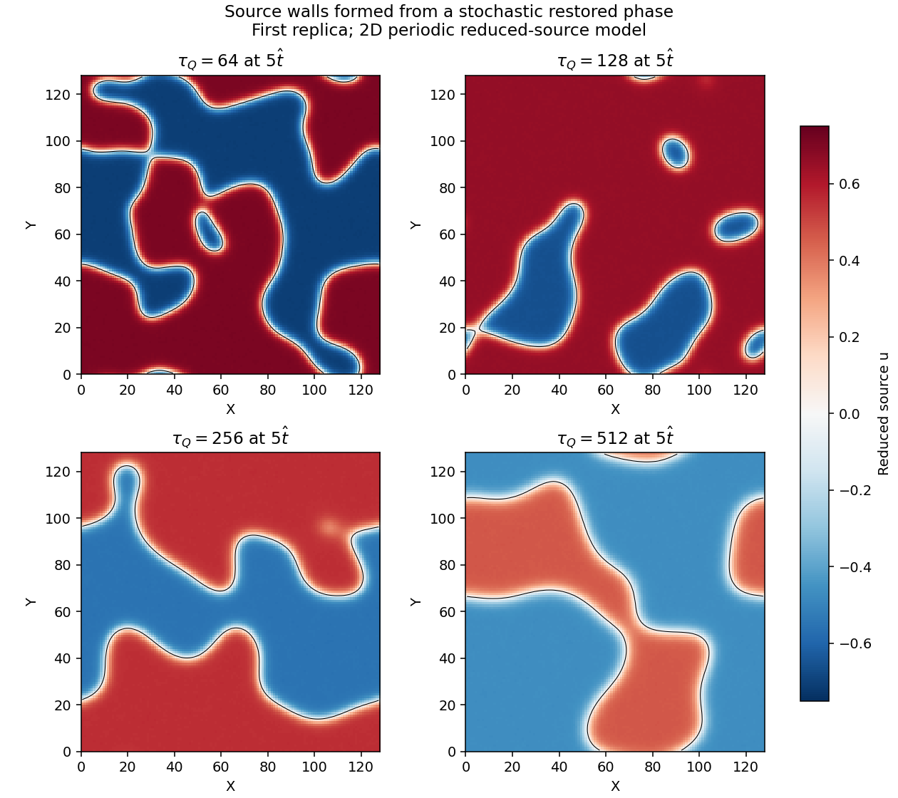
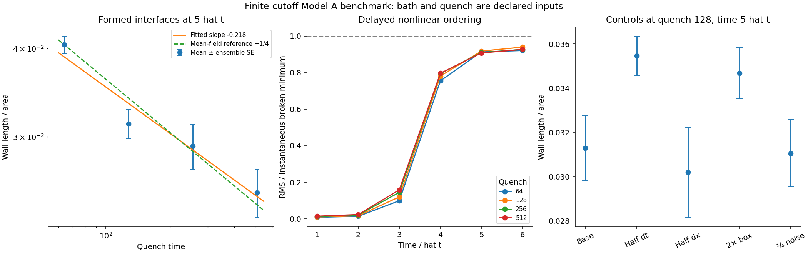

# Real-time formation of source walls under a declared mass quench

This advance supplies a reproducible stochastic real-time formation benchmark, rather than initializing an already formed wall. It implements the wall-list item “Kibble–Zurek simulation of wall formation” at the level of a **two-dimensional reduced source field**. The singlet is eliminated in the potential and the Higgs is on its restored branch. A prescribed overdamped bath drives a prescribed source-mass quench. The particle-physics bath, three-field dynamics, expansion, network gravitational waves, and localized-mode lifetime remain separate calculations.

The four 12-replica ensembles form nonlinear domains. At time $5\hat t$, their smoothed wall-length densities decrease with quench time, with fitted exponent $-0.217922$ and paired-replica bootstrap 95% interval $[-0.290049,-0.150720]$. This is compatible with the overdamped mean-field reference $-1/4$. It does **not** establish that exponent as a continuum universal law: finite cutoff, box size, delayed ordering, coarsening, and the declared noise enter this observation.



## Exact polynomial reduction

Use the dimensionless square potential already underlying the wall sector, including declared leading thermal masses:

$$
\Phi=\frac\lambda4(u^2-1)^2+
\frac{\mu^2}{2}\left(y+\frac{\alpha u^2}{\mu^2}\right)^2+
\frac H4\left[h^2-h_0^2+\frac\kappa H(u^2-1)\right]^2+
\frac{cT^2}{2v^2}u^2+\frac{c_HT^2}{2v^2}h^2.
$$

The exact potential valley is $y=-\alpha u^2/\mu^2$. On $h=0$, its source force is

$$
\partial_u\Phi=u\left[(\lambda+\kappa^2/H)u^2+
 cT^2/v^2-\lambda-\kappa^2/H-\kappa h_0^2\right].
$$

Thus $\lambda_e=\lambda+\kappa^2/H$ and

$$
\epsilon=\frac{cT^2/v^2-\lambda_e-\kappa h_0^2}{\lambda_e},
\qquad V(u;\epsilon)=\frac{\epsilon u^2}{2}+\frac{u^4}{4}.
$$

The coordinate scales are $X=v\sqrt{\lambda_e}\,z$ and $\tau=v\sqrt{\lambda_e}\,t$. These fix units, but do not determine the damping or noise. The mean-field temperature bridge is

$$
T(\epsilon)=v\sqrt{[\lambda_e(1+\epsilon)+\kappa h_0^2]/c}.
$$

The declared inputs are $\lambda=1.76188164948\times10^{-5}$, $\kappa=10^{-7}$, $H=0.13$, $h_0=0.0082$, $\alpha=0.1$, $\mu=10$, $c=0.025$, $c_H=0.4$, and $v=30000$ GeV. These are inputs, not fits to formation data. Across $-0.5\leq\epsilon\leq0.5$, the temperature bridge has minimum 563.150904 GeV and nominal critical temperature 796.415494 GeV. The Higgs curvature is

$$
v^2[-Hh_0^2+\kappa(u^2-1)+c_HT^2/v^2].
$$

Since $\kappa\geq0$, its minimum over all source values occurs at $u=0$. Its smallest value on the chosen temperature interval is 118898.496142 GeV², which is positive. The reduced evolution therefore stays on a Higgs-restored branch of this declared classical thermal potential. This is a high-temperature formation experiment; subsequent cooling into the Higgs-broken wall profile is not evolved.

Eliminating the singlet in the potential is exact. Eliminating its dynamics is an approximation: its induced source kinetic metric is $1+4\alpha^2u^2/\mu^4$. The simulation uses its leading constant term. The reported final-field maximum of the omitted correction is about $1.1$–$2.1\times10^{-6}$ in the primary runs, a sampled diagnostic rather than a bound on the entire time history or a proof of adiabatic tracking. The physical time unit is $5.227043875\times10^{-27}$ seconds. Multiplying a run's dimensionless time by this conversion does not turn an assumed damping into a predicted cosmological timescale.

Nine exact SymPy identities independently check the valley, reduced force, temperature bridge, Higgs curvature, induced metric, quartic flow, stationary OU covariance, zero-mode limit, and OU half-step composition. No physical gauge or quark determinant is inferred from these identities.

## Real-time dynamics and fluctuation normalization

The simulated equation is

$$
\gamma\partial_\tau u=\Delta u-\epsilon(\tau)u-u^3+\xi,
\qquad
\langle\xi(X,\tau)\xi(X',\tau')\rangle
=2\gamma\theta\delta^{(2)}(X-X')\delta(\tau-\tau').
$$

The inputs are $\gamma=1$, $\theta=10^{-5}$, and
$\epsilon(\tau)=\operatorname{clip}(-\tau/\tau_Q,-0.5,0.5)$. The noise temperature $\theta$ is **constant and independent of the temperature bridge**. This is a mass quench with a declared Model-A bath, not a matched finite-temperature cosmology. Its cutoff equilibrium is the Gibbs distribution of the dimensionless lattice energy at bath parameter $\theta$.

The nearest-neighbor lattice Laplacian is diagonalized with an FFT; it is not replaced by a continuum spectral Laplacian. Its nonnegative mode eigenvalues are

$$
k_{j\ell}^2=\frac4{\Delta X^2}
\left[\sin^2(\pi j/N)+\sin^2(\pi\ell/N)\right].
$$

For one step at fixed mass, let $r=k^2+\epsilon$ and $D=e^{-r\Delta\tau/\gamma}$. The exact linear Ornstein–Uhlenbeck update has noise variance

$$
\sigma_k^2=\frac{\theta}{\Delta X^2}
\frac{-\operatorname{expm1}(-2r\Delta\tau/\gamma)}r.
$$

At $r=0$ the continuous limit is $2\theta\Delta\tau/(\gamma\Delta X^2)$. This formula also handles unstable $r<0$ modes without negative variance. Real-space independent unit normals are Fourier transformed, preserving the real-field conjugacy constraints. For stable modes, $D^2 C+\sigma_k^2=C$ exactly with $C=\theta/(\Delta X^2r)$ under this FFT normalization.

The exact local quartic drift is the Bernoulli flow

$$
u\mapsto\frac{u}{\sqrt{1+2\Delta\tau u^2/\gamma}}.
$$

Each step applies half a quartic flow, a full linear OU update, and half a quartic flow. The quench mass is evaluated at the step midpoint. Exact substeps remove a linear diffusion CFL bound; they do not remove splitting error. Deterministic refinement tests show second-order convergence. The ensemble timestep check below concerns the stochastic observable and has finite sampling uncertainty.

Every quench starts at the same positive mass $\epsilon=0.5$, with a linear Gibbs proposal followed by 20 units of nonlinear equilibration. The duration 20 is a declared preparation choice; this release does not prove an equilibrium mixing bound. No freeze-out length or already formed domains are inserted in the initial data. Seed 20261008 is fixed and replica rows are independent. Corresponding rates reuse the same seed, so fits bootstrap replica labels jointly across rates.

## Freeze-out reference and interface observable

Linear zero-momentum relaxation has time $\gamma/|\epsilon|$. Equating it to $|\epsilon/\dot\epsilon|$ gives the mean-field reference

$$
\hat t=\sqrt{\gamma\tau_Q},\qquad
\hat\xi=(\tau_Q/\gamma)^{1/4}.
$$

One consequently expects a reference length-per-area scaling $\hat\xi^{-1}\propto\tau_Q^{-1/4}$ in a two-dimensional source-wall network. This argument supplies a comparison, not an input initial length or a prediction of two-dimensional Ising exponents. Classical cutoff mass renormalization and a measured critical point are not supplied.

Interfaces are measured by periodic marching squares with linear edge crossings and a bilinear saddle decider in ambiguous cells. The primary observable first applies a Gaussian lattice filter with fixed length 1, then measures Euclidean contour length divided by box area. Raw unfiltered zero-contour lengths are also stored. Filtering is an explicit measurement convention, not a fitted scale. Geometry tests cover axial stripes, diagonal stripes, and circular convergence. Two-dimensional lengths are not three-dimensional wall areas.

## Ensemble results and controls

The base grid has $N=128$, side length 128, spacing 1, timestep 0.1, and 12 replicas per quench. Each run stores samples at $0,1,\ldots,6$ reference freeze-out times, raw observations, final-field hashes, and a first-replica snapshot at $5\hat t$.

| Quench time | Wall length / area at $5\hat t$ | Ensemble standard error | RMS / broken minimum |
|---:|---:|---:|---:|
| 64 | 0.04045354 | 0.00116562 | 0.913558 |
| 128 | 0.03129831 | 0.00147805 | 0.917801 |
| 256 | 0.02911551 | 0.00211926 | 0.910067 |
| 512 | 0.02504678 | 0.00194396 | 0.907722 |

At $3\hat t$, RMS amplitudes are only 0.099–0.159 of the instantaneous broken minima. Those are growing precursor zero contours, not mature walls. At $4\hat t$ the ratios reach 0.755–0.797, and at $5\hat t$ they exceed 0.907 in all four ensembles. This delayed ordering is visible in the plot and prevents interpreting every early zero contour as a physical wall.

| Sampling time | Fitted exponent | Paired bootstrap 95% interval | Interpretation |
|---:|---:|---:|---|
| $3\hat t$ | −0.207807 | [−0.247926, −0.165731] | Precursor contours; excluded from formed-wall conclusion |
| $4\hat t$ | −0.207931 | [−0.266014, −0.151630] | Ordering crossover |
| $5\hat t$ | −0.217922 | [−0.290049, −0.150720] | Primary formed-wall measurement |
| $6\hat t$ | −0.230065 | [−0.308608, −0.154507] | Later coarsening |

Intervals are conditional on the four rates, bath, cutoff, filter and preparation, using 2000 paired bootstrap resamples. They quantify ensemble uncertainty rather than systematic error. Later coarsening can itself introduce a quench-rate dependence through the observation time $\hat t\propto\sqrt{\tau_Q}$. Compatibility with $-1/4$ alone does not distinguish freeze-out from subsequent coarsening.

The separate controls at quench 128 and $5\hat t$ are:

| Control | Replicas | Wall length / area | Standard error |
|---|---:|---:|---:|
| Base | 12 | 0.03129831 | 0.00147805 |
| Half timestep: 0.05 | 12 | 0.03547072 | 0.00088653 |
| Half spacing: $N=256$, side 128 | 6 | 0.03020452 | 0.00203750 |
| Double box: $N=256$, side 256 | 6 | 0.03467871 | 0.00116100 |
| Quarter noise: $\theta=2.5\times10^{-6}$ | 12 | 0.03106167 | 0.00151662 |



Different timesteps and grid dimensions consume different random streams; these controls are not pathwise coupled refinement tests. The timestep shift is 0.00417241, about 2.4 times the quadrature sum of the displayed standard errors. That diagnostic must not be presented as established stochastic convergence. The added coupled-path test separates this issue from random-stream variation: compose two half-step Fourier OU innovations, then scale their sum to the exact coarse midpoint OU variance. If the half-step decay/noise factors are $(D_1,\sigma_1)$ and $(D_2,\sigma_2)$, the composed innovation is $D_2\sigma_1W_1+\sigma_2W_2$, with variance $D_2^2\sigma_1^2+\sigma_2^2$. Rescaling by $\sigma_c/\sqrt{D_2^2\sigma_1^2+\sigma_2^2}$ gives exactly the required coarse marginal while the fine path uses its two original innovations. An exact identity and a covariance test check the frozen-mass composition. This creates a consistent noise coupling without changing either split scheme's marginal dynamics.

Twelve paired replicas at quench 128, seed 20261009, give the following results. The coarse steps are shortened slightly to hit the final time exactly; both levels share preparation and end at $5\hat t$.

| Coarse / fine step | Mean coarse-minus-fine wall density | Paired standard error | Mean field RMS difference |
|---|---:|---:|---:|
| 0.09997392 / 0.04998696 | −2.578981×10⁻⁸ | 1.829177×10⁻⁸ | 1.429531×10⁻⁴ |
| 0.04998696 / 0.02499348 | −6.694579×10⁻⁹ | 4.500474×10⁻⁹ | 4.151775×10⁻⁵ |

Thus timestep sensitivity of this formed-wall density is far below the original ensemble standard error in the coupled sample; the earlier uncoupled shift is not evidence of a comparable splitting bias. This is a numerical statistical check at one rate, not a rigorous uniform stochastic error enclosure. The coupled mean differences shrink on refinement, while field differences remain larger than contour-length differences: weak sensitivity of one observable should not be mistaken for equality of full configurations. Likewise, the spacing change alters the physical cutoff of a classical bath, so it is not a renormalized continuum extrapolation. The box and noise tests probe sensitivity at one rate; they do not certify the whole fitted exponent against these inputs.

## Reproduction and closure boundary

From the repository root, install `python/requirements-wall-formation.txt`, then run:

```bash
PYTHONPATH=python python -m unittest discover -s python/tests -p test_wall_kibble_zurek.py
python scripts/prove_wall_formation_reduction.py
OPENBLAS_NUM_THREADS=1 PYTHONPATH=python python python/develop_wall_formation_coupled.py
OPENBLAS_NUM_THREADS=1 PYTHONPATH=python python python/develop_wall_kibble_zurek.py
python scripts/plot_wall_kibble_zurek.py
```

The exact-identity receipt and scientific JSON are deterministic on the recorded runtime. The validation receipt records full-ensemble replay and compares snapshot arrays independently of NPZ container metadata. NumPy FFT and random-generation versions remain part of reproducibility. The runs are inexpensive enough to repeat in this container; the source exposes quench, damping, noise, cutoff, preparation and replica count explicitly.

This closes the absence of an executable wall-formation experiment and exact reduced-source derivation. It leaves physical bath matching, uniform stochastic error bounds, continuum critical calibration, three-field evolution through the later Higgs transition, three-dimensional networks and expansion open. It does not modify the other session's interval width/thermal-shift work or the flavor vacuum analysis.

For context, Suzuki and Zurek, *Dynamics of the order parameter in symmetry breaking phase transitions*, [arXiv:2412.15568](https://arxiv.org/abs/2412.15568), study overdamped Langevin formation and the relation between linear growth and nonlinear ordering. This release's polynomial reduction, discrete bath normalization, ensembles and control data are computed directly from the declared equations above.
