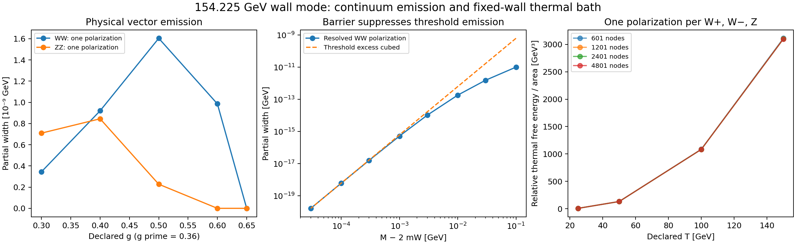

# Wall pair decay and a physical thermal vector channel

This advance replaces zero-energy cubic overlaps with on-shell distorted-wave widths for the 154.225024 GeV radial wall candidate. It also computes the ultraviolet-finite thermal relative determinant of one closed physical vector polarization. The ungauged global O(4) theory and the gauged vector theory are separate calculations. Their rates must not be added. The original wall, mode and gauge-channel reconstruction is unchanged.

The candidate uses the declared inputs v = 30000 GeV, M_heavy = 300000 GeV, g_source = 3000 GeV, v_H = 246 GeV, lambda_H = 0.13 and portal kappa = 10^(-7), with the source quartic retuned by the existing embedded-state solver. These inputs are not an experimentally matched Standard Model parameter determination. The earlier exact quadratic radial decoupling survives; cubic interactions provide the emission vertices.

## Canonical normalization and phase space

Write rho = v z and x = k_wall rho. The radial eigenvector psi contains source, singlet and Higgs components and has N = integral d rho |psi|^2. Its physical profile is sqrt(v/N) psi, so the localized field has the canonical 2+1-dimensional kinetic term. For each even or odd scattering channel use k_z > 0 standing waves satisfying integral dz f_a(k_z,z) f_a(l_z,z) = delta(k_z-l_z). Their asymptotic amplitudes are 1/sqrt(pi), rather than unit incident amplitude. A unitary change to incoming/outgoing waves preserves the inclusive continuum sum.

For a background-even vertex only equal-parity products contribute. The physical overlap G_ab = integral dz c(z) sqrt(v/N) psi(z) f_a(k_z,z) f_b(l_z,z) has units GeV^(1/2). In x coordinates the code evaluates it as (2/k_wall) integral_0^R dx [sqrt(v/N) c_dimensionless psi] f_a f_b. This factor is checked against the analytic Fourier transform of a Gaussian source and the free parity waves.

Parallel momentum is conserved. Normal momentum is not conserved. At parent rest energy M, the final energies are omega_1 = sqrt(p_parallel^2+k_z^2+m^2) and omega_2 = sqrt(p_parallel^2+l_z^2+m^2). The allowed normal-momentum domain is sqrt(k_z^2+m^2)+sqrt(l_z^2+m^2)<M. Integrating the parallel two-dimensional phase space exactly gives

\[
\int\frac{d^2p}{(2\pi)^2}\frac{2\pi\delta(M-\omega_1-\omega_2)}{4\omega_1\omega_2}=\frac1{4M}.
\]

Consequently the leading cubic width is

\[
\Gamma=\frac{S n}{8M^2}\int_{D_M}dk_z\,dl_z\left(|G_{ee}|^2+|G_{oo}|^2\right),
\qquad S=\tfrac12\text{ for identical particles, }S=1\text{ otherwise}.
\]

The massless normal-momentum domain has area M^2/2. A constant single-parity overlap therefore gives Gamma = S n |G|^2/16; this fixes both the phase-space measure and the identical-particle factor independently of the numerical wall. Nested Gaussian quadrature implements the massive domain. Cubic interpolation in the normal momenta and a spatial Simpson rule are refined together.

## Actual Goldstone width in the ungauged theory

The angular potential is V_G/v^2 = lambda_H(h^2-h_0^2)+kappa(u^2-1), and the local cubic force is 2 kappa u psi_u + 2 lambda_H h psi_H. Both the background-induced potential and both components of the vertex are retained. The scattering waves solve the angular operator; the zero-energy Ward profile h/h_0 is not substituted for the on-shell waves.

For three identical-species global Goldstones the finest run gives Gamma_GG = 3.83233455848e-8 GeV, split into 3.10403359118e-8 GeV from even-even waves and 7.28300967296e-9 GeV from odd-odd waves. The corresponding lifetime from this partial width is 1.71752217051e-17 seconds. This is a leading cubic width in the ungauged O(4) theory, not the electroweak lifetime. After gauging, these three angular variables are not additional physical massless particles.

The calculation compares 97, 193 and 289 momentum nodes, 1301, 2601 and 3901 spatial nodes, and phase-space orders 32, 64 and 96. The change between the finest two Goldstone widths is about 6.1e-11 relative. A separate length-18 reconstruction agrees with the length-22 result to about 4.6e-10 relative. These are numerical controls, not rigorous enclosures.

## Physical vector partial widths and threshold suppression

For each outgoing parallel momentum choose the vector polarization perpendicular to both that momentum and the wall normal. Its polarization vector has zero time and normal components. It forms a closed physical TE sector with scalar normal operator -d_z^2 + m_V(z)^2. Contracting the two polarization vectors has magnitude one. The mass vertex is (g^2/2)h psi_H for W and ((g^2+g_prime^2)/2)h psi_H for Z in dimensionless variables. No equivalence-theorem replacement is used.

At declared g = 0.4 and g_prime = 0.36, the finest WW TE partial width is 9.20148937628e-10 GeV, and the ZZ TE partial width is 8.44715462700e-10 GeV. WW is a distinguishable W+ W- pair and ZZ is identical. Their sum is 1.76486440033e-9 GeV, corresponding to 3.72953e-16 seconds from these channels alone. The finest two calculations differ by about 1.0e-6 relative for W and 9.4e-8 for Z. They omit the remaining physical polarizations and all off-shell, fermion and loop channels.

The scan varies g through 0.3, 0.4, 0.5, 0.6 and 0.65 at fixed g_prime. At g = 0.65 both on-shell WW and ZZ pairs remain closed. The on-shell W critical coupling is M/v_H, about 0.626931. A nonzero cubic vertex alone does not override a closed pair threshold.

A positive nontrivial Higgs barrier has no zero-energy TE resonance. Its normalized core wave vanishes linearly with k_z at threshold. Therefore G_ab is proportional to k_z l_z and the width falls as (M-2m_V)^3, rather than the linear excess law of an unsuppressed constant overlap. For epsilon = M-2m, the near-threshold domain is a quarter disk of radius sqrt(2m epsilon), and integral dk dl k^2 l^2 = pi m^3 epsilon^3/12 at leading order. The actual W scan from excess 0.1 GeV to 0.00003 GeV approaches this law, with the last two points giving logarithmic slope 2.98889. The positive-profile hypothesis is numerically supported here; the previous interval-certification gap remains.

## Finite-temperature damping on the fixed wall

At equilibrium, emission and inverse decay must both enter the retarded damping rate. The statistical factor is (1+n_1)(1+n_2)-n_1 n_2 = 1+n_1+n_2, with omega_1 = (M^2+k_z^2-l_z^2)/(2M), omega_2 = M-omega_1 and n_i = 1/(exp(omega_i/T)-1). Multiplying only by the emission factor would give a different observable.

At T = 100 GeV the enhancement factors are 2.78264 for the global Goldstone width, 2.75264 for the W TE partial width and 2.72752 for Z TE, using the same zero-temperature background and declared g = 0.4. Orders 64, 96 and 128 independently reproduce the T = 150 GeV Goldstone damping integral. These are fixed-wall pair-damping responses; they do not include Landau/scattering channels or temperature-dependent changes of the wall, vertices and screening masses.

## A thermal vector relative determinant

The same closed physical TE sector supplies a gauge-independent Gaussian thermal contribution without Goldstone/ghost counting. On a physical z box impose identical Dirichlet endpoints and identical lattices for wall and vacuum operators. Subtract the thermal traces mode by mode. The contribution from a normal mass a is integrated exactly over parallel momentum:

\[
F_2(a,T)=-\frac{T^3}{2\pi}\sum_{n=1}^{\infty}e^{-na/T}
\left(\frac{a/T}{n^2}+\frac1{n^3}\right).
\]

The relative free energy per area is sum_j [F_2(sqrt(lambda_wall,j),T)-F_2(sqrt(lambda_vacuum,j),T)]. It is ultraviolet finite. Positive mass barriers give nonnegative shifts by eigenvalue monotonicity and d F_2/d(a^2) = -T log(1-exp(-a/T))/(4 pi)>0. This is a statement about this operator and thermal trace, not a proof that the finite-sampled Higgs background obeys the barrier hypothesis everywhere.

At g = 0.65 and g_prime = 0.36, count one TE polarization for each of W+, W- and Z: two charged copies plus one neutral copy. Boxes with 601, 1201, 2401 and 4801 grid nodes give numerical spacing convergence. Richardson extrapolation at fixed length gives combined relative thermal free energies per area of about 7.65225, 132.12875, 1083.30354 and 3098.61056 GeV^3 at declared temperatures 25, 50, 100 and 150 GeV. The final-spacing corrections are respectively 0.0000309, 0.001395, 0.032867 and 0.182862 GeV^3. These corrections estimate numerical convergence, not uncertainty from omitted physics.

At T = 100 GeV, radius-14 and radius-18 boxes at nearly matched spacing agree with the radius-22 value within about 0.000053 GeV^3. The 240-term thermal series has exponentially small tails for the nonzero vector masses used here. The free-box trace cancels, and a smooth positive barrier has positive free-energy cost with second-order lattice convergence in the independent tests.

This is partial progress on the thermal-bath item. A full vector determinant needs the remaining physical sectors or a complete gauge-fixed treatment including the angular and ghost contributions. Zero-temperature Coleman-Weinberg terms also need counterterms and renormalization conditions. Debye/daisy resummation, two-loop terms, thermal wall relaxation, bounce recomputation and corrected nucleation rates are not included. No temperature-dependent transition or cosmologically viable benchmark is claimed.

## Reproduction and remaining lifetime question

Run `OPENBLAS_NUM_THREADS=1 PYTHONPATH=python python python/develop_wall_pair_decay.py` for the receipt, and `python scripts/plot_wall_pair_decay.py` for the figure. The modules are `wall_pair_decay.py` and `wall_thermal_vectors.py`; the independent analytic and numerical tests are `test_wall_pair_decay.py`. The prior gauge-channel monograph documents the exact quadratic block and Ward identities on which the vertices depend.

A classical simulation started with exactly zero angular fields keeps those fields zero: their nonlinear equations preserve that subspace. It cannot reproduce spontaneous quantum pair emission merely by exciting the radial mode. A real-time nonlinear lifetime comparison must specify fluctuations, their normalization, backreaction and the continuum/volume limits. No full nonlinear lifetime simulation or full gauged lifetime is claimed in this advance. The computed continuum kernels, on-shell rates and thermal factors now provide quantitative targets for that work.

